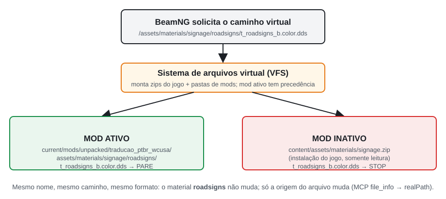
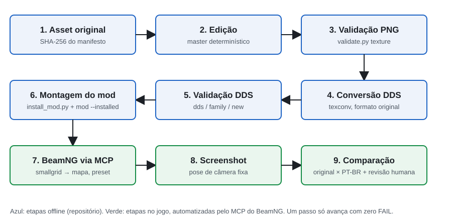
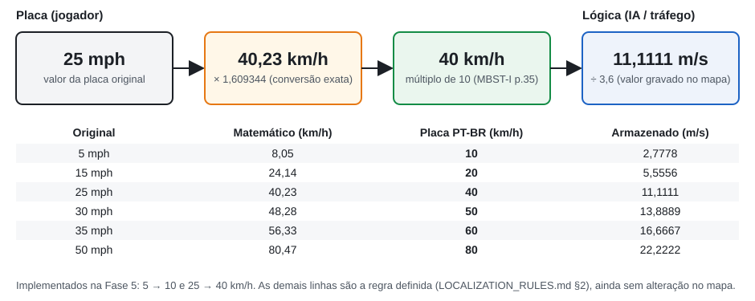
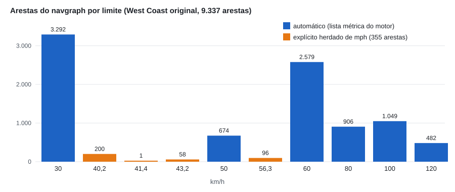
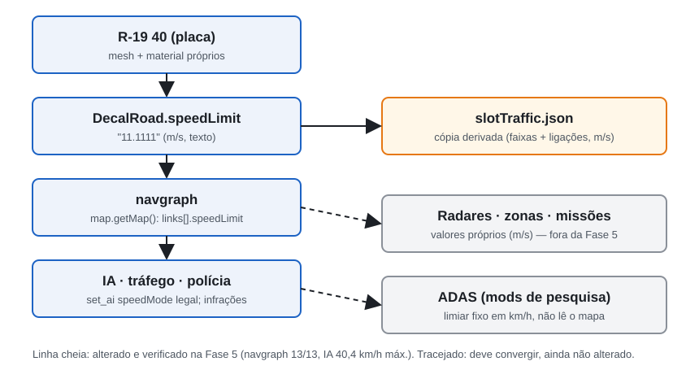

# Localização Técnica e Funcional de um Ambiente de Simulação Veicular:
## Adaptação do West Coast USA do BeamNG.drive para o Português Brasileiro

| | |
|---|---|
| **Versão do artigo** | 1.0 |
| **Data** | 02/10/2026 |
| **Versão do BeamNG** | BeamNG.drive 0.39.4.0 (Steam, Direct3D 12) |
| **Commit do projeto documentado** | `70329b1` (branch `main`): estado da Fase 5 no repositório local |
| **Estado máximo documentado** | Fase 5 concluída e validada localmente. Primeira família definitiva (`t_roadsigns`), placas R-19 10/40 km/h e limites funcionais sincronizados |
| **Repositório** | `github.com/BernardoHille/traducao_west_coast_beamng` |

> **Nota de rastreabilidade.** Quando este artigo foi escrito, o remoto (`origin/main`) estava em `0256004` (Fase 4). Os seis commits da Fase 5 (`f83e4ce` → `70329b1`) existiam só no repositório local. Todos os resultados da Fase 5 citados aqui podem ser verificados nesses commits e nos arquivos indicados. As capturas novas desta fase documental foram feitas em 02/10/2026, com o mod no estado do commit `70329b1`.

---

## Resumo

Jogos de simulação veicular de mundo aberto apresentam ao jogador um ambiente cheio de texto: placas de trânsito, letreiros, outdoors e marcações no asfalto. Esse texto também está ligado à lógica da simulação, porque um limite de velocidade é ao mesmo tempo uma imagem e um número que a inteligência artificial (IA) do tráfego obedece. Este artigo é um estudo de caso da localização do mapa *West Coast USA* do BeamNG.drive 0.39.4.0 para o português brasileiro. A premissa foi preservar o universo fictício americano e adaptar só linguagem, unidades e convenções de sinalização.

O ponto de partida foi um conjunto de 11 texturas traduzidas anteriormente. Uma auditoria mostrou que essas imagens tinham sido regeneradas por inteiro: entre 26% e 78% dos pixels mudaram, o canal alfa se perdeu e as coordenadas de textura deixaram de bater. O trabalho seguiu cinco fases: auditoria, prova de conceito de *override* pelo sistema de arquivos virtual, automação de QA visual pelo servidor MCP do jogo, especificação de localização com 308 entradas e um validador automático. A primeira família foi produzida a partir dos originais.

Os principais achados foram estes:
- a sinalização de velocidade é montada por glifos compartilhados, o que exigiu material, textura e malha próprios para a placa brasileira R-19;
- o jogo original já tinha placas que divergiam do limite funcional das vias;
- trocar "25 mph" por "40 km/h" só na imagem criaria uma placa que mente.

O resultado é um atlas reconstruído com 0 pixel alterado fora de 44 regiões autorizadas. Placas R-19 10 e 40 km/h passaram a valer também como limite de 101 vias, e a IA foi verificada respeitando os novos valores. A contribuição é um método reproduzível que trata localização como coerência entre imagem, material, malha, dados do mapa e comportamento da simulação.

**Palavras-chave:** BeamNG.drive; localização de jogos; simulação veicular; sinalização de trânsito; *modding*; texturas DDS; português brasileiro; QA automatizado.

## Technical and Functional Localization of a Vehicle Simulation Environment: Adapting BeamNG.drive's West Coast USA to Brazilian Portuguese

### Abstract

Open-world driving simulators surround the player with text: road signs, storefronts, billboards and pavement markings. Much of it is tied to the simulation, because a speed-limit sign is both a picture and a number that the traffic AI obeys. This paper is a case study of localizing the *West Coast USA* map of BeamNG.drive 0.39.4.0 into Brazilian Portuguese while keeping the fictional American setting and adapting only language, units and signage conventions.

The project started from eleven previously "translated" textures. An audit showed they had been fully regenerated: 26–78% of pixels changed, alpha channels were lost and texture coordinates no longer matched. The work then went through five phases: an audit, a proof of concept that overrides game files through the virtual file system, automated visual QA through the game's Model Context Protocol (MCP) server, a 308-entry localization specification and an automated asset validator. The first texture family was then rebuilt from the originals.

Three findings shaped the outcome:
- speed signs are assembled from glyphs shared with other objects, so the Brazilian R-19 sign needed its own material, texture and mesh;
- the original map already had signs that disagreed with the functional road limits;
- relabelling "25 mph" as "40 km/h" in the image alone would produce a sign that lies.

The result is a rebuilt atlas with zero changed pixels outside 44 authorized regions, plus R-19 signs for 10 and 40 km/h that are also enforced on 101 roads; the AI was checked against the new limits. The main contribution is a reproducible method that treats localization as consistency between image, material, mesh, map data and simulated behaviour.

**Keywords:** BeamNG.drive; game localization; driving simulation; traffic signs; modding; DDS textures; Brazilian Portuguese; automated QA.

---

## 1. Introdução

### 1.1 O ambiente

O **BeamNG.drive** é um simulador veicular baseado em física de corpos macios: a estrutura de cada veículo é uma rede de nós e vigas que se deformam. Os mapas são cenários abertos, com tráfego controlado por IA, missões e sistemas de pontuação. O **West Coast USA** é um dos mapas principais. Ele retrata uma região fictícia da costa oeste americana, com a cidade de Belasco, a Ilha Spearleaf, um porto, rodovias, pedágios, um autódromo e áreas residenciais e industriais.

Todo esse ambiente carrega texto em inglês e convenções americanas: placas STOP e YIELD, limites em milhas por hora, preços em dólar, distâncias em milhas, nomes de ruas com "St" e "Rd" e marcações no asfalto como "KEEP CLEAR" e "BUS ONLY". A Figura 1 mostra a região do mapa onde ficam os pontos usados ao longo deste artigo.


*Figura 1. Vista de cima do centro de Belasco e de Chinatown, capturada no jogo pelo MCP com câmera livre a 760 m de altitude, norte para cima e mod desligado. Os marcadores numerados indicam os pontos usados no artigo: (1) placa STOP do ponto de QA de Chinatown; (2) e (3) legendas BUS ONLY e KEEP CLEAR pintadas no pavimento; (4) placa SPEED LIMIT 25 na colina; (5) placa YIELD; (6) a placa SPEED LIMIT 5 do estacionamento, logo abaixo do quadro. As posições foram projetadas a partir das coordenadas do mapa e conferidas com esferas de depuração desenhadas no jogo.*

### 1.2 O que se quer localizar

O objetivo **não** é transformar Belasco numa cidade brasileira. A regra adotada (`LOCALIZATION_RULES.md` §0) foi:

> *West Coast USA* localizado para jogadores brasileiros. Não é uma conversão total para o Brasil.

Belasco continua sendo Belasco. Marcas fictícias como Gavril, Hirochi, Nodeoline e Spearleaf continuam as mesmas. O que muda é a **linguagem visual e as convenções**: idioma, unidades, moeda, formato numérico e padrão de sinalização. O jogador brasileiro deve ler "Rua Brittlebush", ver uma placa circular de 40 km/h e encontrar preços em R$, mas continua dirigindo num lugar que é, claramente, a Califórnia ficcional do jogo.

### 1.3 Por que traduzir os textos não basta

Num programa comum, localizar costuma significar trocar *strings* de interface. Num ambiente simulado, a maior parte do texto não é *string*: é **imagem dentro de texturas**, aplicada sobre malhas 3D por coordenadas fixas. Essas imagens estão ligadas a materiais com transparência, a mapas auxiliares (relevo, oclusão, rugosidade) e, no caso da velocidade, a dados que definem o comportamento do tráfego. Este artigo mostra três tipos de dificuldade, todos observados no projeto:

1. **Integridade gráfica.** Uma tradução que redesenha a imagem desloca regiões, apaga transparências e quebra o recorte das placas (seções 5 a 10).
2. **Composição.** Muitas placas não existem como imagem única. São montadas pela malha a partir de pedaços compartilhados, como algarismos, palavras soltas e painéis em branco. Mudar um pedaço muda vários objetos (seções 6, 10 e 18).
3. **Coerência funcional.** Uma placa de velocidade é uma promessa ao jogador. Se ela diz 40 km/h e a IA anda a 60, a localização introduz uma mentira (seções 14 a 16).

### 1.4 Problema central

O problema pode ser enunciado assim: **como adaptar o conteúdo visual e funcional de um mapa de simulação para outra cultura sem quebrar a integridade técnica dos assets, sem modificar a instalação do jogo e mantendo placa, dados e comportamento coerentes entre si?**

### 1.5 Convenções deste texto

O artigo separa dois tipos de afirmação:
- **descobertas experimentais deste projeto**, sempre ligadas a um arquivo, relatório, captura ou commit do repositório. Exemplo: "no experimento realizado neste projeto, recarregar o mesmo mapa manteve a textura em cache";
- **fontes externas**, como os Manuais Brasileiros de Sinalização de Trânsito (MBST) e a documentação da Microsoft, citadas pela página do PDF ou pela URL.

O BeamNG não publica documentação detalhada de vários comportamentos usados aqui. Tudo o que é dito sobre o motor do jogo foi **observado** na versão 0.39.4.0 e pode mudar em outras versões.

---

## 2. Objetivos

### 2.1 Objetivo geral

Localizar visual e funcionalmente os elementos do West Coast USA para o português brasileiro, mantendo a integridade técnica dos assets e a coerência entre o que o jogador vê e o que a simulação faz.

### 2.2 Objetivos específicos

1. Traduzir a sinalização e os textos visíveis segundo regras explícitas e verificáveis.
2. Preservar a identidade visual do jogo: cores, desgaste, tipografia aproximada e composição das placas.
3. Converter unidades (mph → km/h, milhas → km, pés → metros) e formatos (vírgula decimal, 24 h, R$).
4. Adaptar a sinalização regulamentar ao padrão brasileiro (MBST/CONTRAN) quando houver equivalente claro.
5. Manter a coerência funcional: placa, limite da via, IA e tráfego no mesmo valor.
6. Preservar materiais, formatos de compressão, canais alfa e coordenadas UV dos originais.
7. Automatizar o QA visual no jogo e a validação técnica dos arquivos.
8. Evitar modificações destrutivas: nada é alterado na instalação do jogo.
9. Garantir reversibilidade: desativar o mod devolve o jogo exatamente ao estado original.

---

## 3. Método e linha do tempo

O projeto foi dividido em fases curtas. Cada fase terminou com um commit e um relatório, e uma fase só começava depois que a anterior estivesse comprovada. A Tabela 1 resume as fases cobertas por este artigo.

*Tabela 1. Fases do projeto (datas dos commits, fuso −03:00).*

| Fase | Commit | Data | Entrega principal | Evidência |
|---|---|---|---|---|
| 0: Estrutura | `8d10748` | 30/09 14:55 | Repositório, manifesto SHA-256 dos originais, inventário de famílias | `docs/inventory/` |
| 1: PoC do *override* | `107e849` | 30/09 15:40 | Uma textura substituída por mod, teste ON/OFF/ON | `docs/BEAMNG_OVERRIDE_POC.md` |
| 2: QA automatizado | `50911d5` | 30/09 16:28 | Runner MCP, catálogo de pontos, presets, teste de reprodutibilidade | `tests/reports/t_roadsigns_automation_test.md` |
| 3: Regras de localização | `511b91e` | 30/09 17:10 | `LOCALIZATION_RULES.md`, matriz de 308 entradas, inventário de velocidades | `docs/localization/` |
| 4: Validador | `0256004` | 30/09 17:44 | `validate.py`: texturas, DDS, famílias, mod, velocidades | `tests/reports/validation_baseline.md` |
| 5: Primeira produção | `f83e4ce` … `70329b1` | 30/09 21:22 – 01/10 01:07 | Atlas `t_roadsigns`, R-19 10/40, 101 vias, `slotTraffic.json` | `docs/production/PHASE5_ROADSIGNS.md` |
| 5.5: Documentação | (este artigo) | 02/10 | Artigo, figuras, dados | `docs/article/` |

Três princípios de método atravessam todas as fases:
- **A base é sempre o original do jogo**, conferido por SHA-256. A tradução anterior serve só como consulta de texto.
- **Toda mudança precisa de uma fonte técnica** que justifique onde ela pode acontecer: coordenada UV de uma malha instanciada, dado de decalque ou objeto do mapa.
- **Nenhuma afirmação vale sem evidência reproduzível**: captura com câmera salva, relatório do validador ou consulta ao jogo.

---

## 4. Estado inicial do projeto

### 4.1 O que existia

O material encontrado na auditoria de 30/09/2026 era uma pasta de trabalho sem versionamento, com:
- **35 texturas originais** extraídas do jogo, cada uma em DDS (formato do jogo) e em PNG (para edição);
- **13 PNG "PT-BR"** com o sufixo `_ptbr`. Eles correspondem a **11 texturas traduzidas** e **1 máscara de opacidade** (`t_spearleaf_refinery_logo_o.data`). O décimo terceiro arquivo, `t_sealbrik_logo_b.color_ptbr.png`, é uma **cópia idêntica** do original (mesmo hash): uma "tradução" que não traduziu nada;
- um guia de tradução (`docs/legacy/LEIA-ME_GUIA_DE_TRADUCAO.md`) com caminhos incompletos e a instrução de exportar tudo como BC7.

Também faltavam peças essenciais: não havia DDS PT-BR, nenhum mod montado, nenhum teste no jogo, nenhum controle de versão e nenhum arquivo em camadas. As traduções existiam só como PNG achatado.

### 4.2 41 ocorrências ou 35 texturas?

A auditoria registrou "**41 texturas** em 9 categorias". Ao montar o manifesto da Fase 0 (`original_files_manifest.csv`), com um hash por arquivo, só apareceram **35 DDS originais**, cada um com seu PNG. A diferença vinha da forma de contar: o número 41 contava **ocorrências nos zips do jogo**, e algumas texturas aparecem em mais de um zip. Por exemplo, `clutter_commercial_*` está tanto no zip do mapa quanto em `art_shapes.zip`.

O manifesto passou a ser a contagem de referência. A auditoria foi mantida como *snapshot* imutável, e a correção ficou registrada em `texture_families.md` e no `PROJECT_STATUS.md` (problema nº 9). Essa diferença é pequena, mas mostra um padrão que se repetiu no projeto: **um número herdado precisa ser reconferido pela fonte primária antes de virar base de decisão.** O mesmo aconteceu com as "37 placas de 5 mph", que eram 7 (seção 18.4).

### 4.3 Onde as texturas ficam

Quase todas as texturas com texto ficam em **assets globais** (`content/assets/materials/*.zip`), e não no zip do mapa. Por isso, substituir `t_roadsigns_b.color` muda essa textura em qualquer mapa que a use. Essa característica orientou a política de escopo (seção 29).

---

## 5. Auditoria das traduções antigas

### 5.1 Regeneração da imagem inteira

Uma edição que só troca palavras altera uma fração pequena dos pixels de uma textura. A auditoria comparou cada original com seu `_ptbr`, amostrando a cada 4 pixels com tolerância 12 (Tabela 2).

*Tabela 2. Pixels alterados nas referências antigas (auditoria, amostragem 1:4, tolerância 12).*

| Textura | Pixels alterados | Alteração forte |
|---|---:|---:|
| `ind_industrial_signs_d` | 77,8% | 21,2% |
| `t_movie_studio_signage_b` | 65,2% | 27,6% |
| `t_billboardsigns_dealers_b` | 51,5% | 16,9% |
| `billboards_d` | 50,2% | 7,5% |
| `t_eca_genericsigns_b` | 50,0% | 31,6% |
| `t_decal_roadmarkings_b` | 49,9% | 14,0% |
| `t_roadsigns_b` | 45,4% | 17,5% |
| `t_sponsors_b` | 32,7% | 1,7% |
| `eca_roadsigns_d` | 31,6% | 8,1% |
| `t_steel_factory_brand_b` | 26,0% | 6,6% |
| `t_spearleaf_refinery_logo_b` | 25,9% | 15,5% |

Mudanças de 26% a 78% só se explicam com a imagem inteira redesenhada, provavelmente por um processo generativo ou de *upscaling*. Os PNG foram salvos em dois lotes, com 31 minutos de intervalo. Sujeira, desgaste e cores de áreas sem texto mudaram sem necessidade, e deixaram de combinar com os mapas de relevo e rugosidade originais.

O validador da Fase 4 refez a medição com todos os pixels e tolerância 2, e os percentuais subiram: 76,9% em `eca_roadsigns_d`, 88,7% em `t_movie_studio_signage_b` e 95,2% em `ind_industrial_signs_d`. As duas medições não se contradizem; elas usam critérios diferentes, e o relatório do validador registra essa diferença.

### 5.2 Mudanças fora das áreas de texto

A medida mais importante não é quantos pixels mudaram, e sim **onde** mudaram. O validador compara as mudanças com **regiões autorizadas**: retângulos do atlas com uma fonte técnica que comprova onde fica cada elemento (seção 26). Para `t_roadsigns`, a referência antiga alterou **59,88%** dos pixels que estão **fora** das 44 regiões confirmadas na Fase 5 (923.567 px). Na Fase 4, com só 7 regiões, o número era 64,74%. A Figura 2 mostra o mapa de calor produzido pelo validador.


*Figura 2. Mapas de calor gerados por `validate.py texture` sobre o atlas `t_roadsigns_b.color`. Vermelho indica pixel alterado e verde contorna as 44 regiões autorizadas. (A) Referência PT-BR antiga: as mudanças cobrem praticamente o atlas inteiro, inclusive pictogramas, setas e áreas que não tinham texto (59,88% dos pixels fora das regiões mudaram; FAIL). (B) Atlas reconstruído na Fase 5: as mudanças ficam só dentro das regiões (188.445 px dentro, 0 px fora; PASS).*

### 5.3 Os demais problemas

A auditoria também registrou:
- **Perda de alfa e ruído no canal alfa** (seção 9).
- **Deslocamento de elementos do atlas** (seção 6): o octógono do STOP e o triângulo do YIELD foram desenhados em posições diferentes das que a malha espera.
- **Mapas auxiliares incompatíveis:**
  - o emissivo `eca_genericsigns_emissive` não acompanha o novo layout de `t_eca_genericsigns_b`, em que "Pousada Firwood" e o logotipo Nodeoline mudaram de posição;
  - nas marcações de asfalto, só a cor foi traduzida e a máscara continuou com as letras em inglês (seção 10).
- **Formatos DDS**: o guia mandava usar BC7 em tudo (seção 8).
- **Conteúdo textual**: ordem errada dos nomes de rua ("Brittlebush Rua"), "SPEED LIMIT" mantido, preços sem R$ e "RON" aplicado a octanagem americana (seções 19 a 22).

A conclusão foi direta: **a arte antiga não servia como master**, mas boa parte das escolhas de vocabulário podia ser reaproveitada (seção 25).

---

## 6. O problema dos atlas e das coordenadas UV

### 6.1 O que é um atlas

Uma **textura** é uma imagem aplicada sobre a superfície de um modelo 3D (malha). Para economizar memória e chamadas de desenho, os jogos juntam muitas imagens pequenas numa imagem grande, o **atlas de texturas**. O `t_roadsigns_b.color` é um atlas de 2048 × 1024 pixels com dezenas de placas, palavras soltas, algarismos e pictogramas (Figura 3).

Cada vértice da malha guarda uma **coordenada UV**, que é a posição (u, v) entre 0 e 1 dentro da textura. O triângulo da malha mostra só o pedaço do atlas delimitado pelas UVs dos seus vértices. Uma placa STOP, portanto, não "contém" a palavra STOP. Ela contém um quadrado que aponta para a região x 1164–1290, y 231–358 do atlas. As 52 instâncias de `sign_stop.dae` no mapa apontam todas para a mesma região.


*Figura 3. Atlas original `t_roadsigns_b.color` (2048 × 1024; áreas transparentes sobre cinza-escuro). Os retângulos sólidos são as 44 regiões autorizadas da Fase 5, com coordenadas lidas de `tools/validation/config/allowed_regions.json`: regulamentação em vermelho, painéis em azul, palavras recortadas pela opacidade em roxo e nomes de vias em verde. Os tracejados laranja marcam áreas compartilhadas que foram preservadas, com coordenadas do inventário UV em `t_roadsigns_plan.md`: algarismos, frações, SPEED LIMIT, MPH, ONLY, CARPOOLS e o painel branco das placas de velocidade.*

### 6.2 Por que 10 pixels importam

Se a imagem dentro da região muda de lugar, a malha continua amostrando a **mesma** região. O resultado é um recorte errado: aparece uma borda do elemento vizinho de um lado e falta conteúdo do outro.

Medimos isso na referência antiga. A borda esquerda do octógono vermelho, que no original está em x = 1167, aparece em x = 1177, **10 pixels à direita**. Em uma região de 126 px de largura, isso é cerca de 8% da placa. A Figura 4 mostra o atlas ampliado; a Figura 5 mostra o efeito no jogo, na mesma câmera.


*Figura 4. Região do R-1 no atlas, ampliada 3× sem interpolação. O contorno ciano é a região UV amostrada pelas malhas (x 1164–1290, y 231–358). (A) Original. (B) Referência PT-BR antiga: o octógono está deslocado para a direita, a faixa cinza à esquerda entra no recorte e o "E" encosta na borda. (C) Reconstrução da Fase 5: o octógono original é mantido pixel a pixel e só a legenda muda.*


*Figura 5. Placa octogonal no ponto de QA de Chinatown (`roadsigns_chinatown_stop`), com a mesma câmera e o mesmo preset diurno, capturada em 02/10/2026. (A) Textura original com STOP. (B) Referência PT-BR usada só no PoC da Fase 1 e depois rejeitada por causa do deslocamento no atlas: aparece uma faixa branca à esquerda e o "E" é cortado na borda direita. (C) Versão reconstruída a partir do atlas original na Fase 5. Para o estado (B), a cópia instalada do mod recebeu temporariamente o DDS do PoC e foi restaurada logo depois.*

### 6.3 A consequência para o método

A regra derivada desse caso (`TEXTURE_GUIDELINES.md`, Regra 10) é que nenhum elemento pode sair da sua região original. Isso levou a três práticas:
1. Editar **só dentro** de regiões confirmadas pela UV de malhas realmente instanciadas no mapa.
2. **Copiar todo o resto pixel a pixel** do original.
3. Verificar isso **automaticamente**: o validador falha se qualquer pixel fora das regiões mudar acima da tolerância.

---

## 7. Prova de conceito do sistema de *override*

### 7.1 Sistema de arquivos virtual

O BeamNG não lê os arquivos direto do disco. Ele usa um **sistema de arquivos virtual (VFS)** que monta numa árvore única os zips da instalação (`content/…`) e as pastas de mods do usuário. Quando o jogo pede `/assets/materials/signage/roadsigns/t_roadsigns_b.color.dds`, o VFS decide de qual origem entregar o arquivo.

A hipótese da Fase 1 foi esta: se um mod contiver um arquivo com **o mesmo caminho virtual e o mesmo nome**, ele terá precedência sobre o zip do jogo. Nesse caso não seria preciso tocar na instalação nem no material.



*Figura 6. Resolução do caminho virtual da textura do atlas. Com o mod ativo, o VFS entrega o arquivo da pasta do mod no diretório do usuário; com o mod inativo, entrega o arquivo de `signage.zip` na instalação. O material `roadsigns` e a malha não mudam. A origem real foi conferida em cada execução pela ferramenta MCP `file_info` (campo `realPath`).*

### 7.2 O experimento

Montamos um mod mínimo, com o DDS do atlas e um `info.json`, em `current/mods/unpacked/traducao_ptbr_wcusa/`. A textura usada foi a referência antiga, só como marcador visual. A sequência foi:

```text
mod ON  + recarga → PARE
mod OFF + recarga → STOP
mod ON  + recarga → PARE
```


*Figura 7. Capturas originais da Fase 1 (30/09/2026, `tests/screenshots/poc/`), recortadas em torno da placa. (A) Mod ativo: a textura do PoC aparece, com o defeito de UV. (B) Mod desativado por `core_modmanager.deactivateMod` e mapa recarregado: volta o STOP original. (C) Mod reativado: o PARE volta. A câmera da Fase 1 é parecida, mas não idêntica, à câmera de catálogo usada na Figura 5.*

O experimento comprovou quatro coisas:
1. O caminho de *override* existe e funciona sem alterar a instalação; nenhum arquivo do jogo teve a data alterada.
2. O processo é reversível.
3. O formato do DDS (BC7 sRGB, 2048 × 1024, 12 mipmaps) foi aceito.
4. O defeito de UV da referência antiga apareceu na prática, e não só na análise de pixels.

Ele **não** comprovou que a tradução estava boa. O PoC foi registrado como "override técnico validado; tradução não aprovada".

### 7.3 Decisão: override por VFS

| Etapa | Conteúdo |
|---|---|
| **Problema** | Substituir texturas do jogo sem quebrar a instalação e de forma reversível |
| **Alternativas** | (a) editar os zips do jogo; (b) criar materiais novos apontando para texturas com outros nomes; (c) arquivo de mesmo caminho virtual num mod |
| **Riscos** | (a) é destrutivo, se perde em cada atualização e é irreversível sem reinstalar; (b) exige redefinir materiais do jogo, com risco de colisão; (c) depende de um comportamento do VFS que não está documentado |
| **Decisão** | (c), validada experimentalmente antes de qualquer produção |
| **Consequência** | O mod é uma árvore que espelha os caminhos virtuais. O nome final é sempre o original, nunca `_ptbr`. Desativar o mod restaura o jogo. Em contrapartida, o *override* atinge todos os mapas que usam o mesmo arquivo (seção 29) |

---

## 8. Formato DDS e pipeline gráfico

### 8.1 PNG intermediário, DDS final

O **PNG** é um formato de imagem sem perdas, adequado para edição e comparação de pixels. O jogo, porém, carrega **DDS** (*DirectDraw Surface*), um contêiner que guarda a textura já no formato que a placa de vídeo usa, normalmente **comprimida em blocos** e com **mipmaps** prontos. Os **mipmaps** são cópias reduzidas da textura (½, ¼, … até 1 × 1) que a GPU usa quando o objeto está longe, para evitar cintilação e economizar banda.

No pipeline do projeto, o PNG é o intermediário editável e validável, e o DDS é o artefato final, gerado com o `texconv` da Microsoft (DirectXTex). O validador lê o cabeçalho DDS com um parser próprio e confere formato, dimensões, mipmaps e tamanho calculado.

### 8.2 Compressão em blocos

Os formatos BC (*block compression*) dividem a imagem em blocos de 4 × 4 pixels e codificam cada bloco com tamanho fixo. A documentação da Microsoft descreve os formatos encontrados no projeto ([Texture Block Compression in Direct3D 11](https://learn.microsoft.com/en-us/windows/win32/direct3d11/texture-block-compression-in-direct3d-11)):

| Formato | Conteúdo | Bytes por bloco 4×4 |
|---|---|---:|
| **BC1** (DXT1) | cor RGB 5:6:5, alfa de 0 ou 1 bit | 8 |
| **BC3** (DXT5) | cor RGB 5:6:5 + alfa de 8 bits | 16 |
| **BC4** | um único canal de 8 bits | 8 |
| **BC7** | cor de 4 a 7 bits por canal, alfa opcional, 8 modos por bloco | 16 |

Além disso, a cor pode ser **sRGB** ou **linear**. Em sRGB, os valores estão codificados com a curva de gama da tela, e a GPU os converte para luz linear ao amostrar. Isso é certo para cores e errado para dados. Uma máscara de opacidade, um mapa de rugosidade ou um mapa de normais guardam **números**, não cores, e precisam ser lidos sem conversão (linear). Um BC7 marcado como sRGB por engano altera todos os valores intermediários desses mapas.

### 8.3 Por que não "tudo em BC7"

O guia antigo instruía exportar tudo como BC7. O manifesto mostra que os 35 originais usam cinco variantes (Tabela 3).

*Tabela 3. Formatos DDS dos 35 originais (`original_files_manifest.csv`).*

| Formato original | Texturas | Exemplos | Papel |
|---|---:|---|---|
| DX10 BC7_UNORM_SRGB | 21 | `t_roadsigns_b.color`, `t_sponsors_b.color`, `t_decal_roadmarkings_b.color` | cor |
| DX10 BC7_UNORM (linear) | 2 | `t_roadsigns_o.data`, `ut_roadsigns_d` | opacidade, difuso legado |
| BC4_UNORM | 3 | `clutter_commercial_o.data`, `t_spearleaf_refinery_logo_o.data`, `t_usa_roadsigns_text_o.data` | opacidade |
| BC3 (DXT5) | 5 | `eca_roadsigns_d`, `usa_roadsigns_text`, `busstop_d`, `eca_genericsigns_emissive`, `arrows_sign_d` | difuso com alfa, emissivo |
| BC1 (DXT1) | 4 | `speed_sign`, `usa_roadsigns_turn_warning`, `billboards_d`, `checkpoint_sign` | difuso sem alfa |

Converter tudo para BC7 traria dois problemas: aumentaria o tamanho de texturas BC1 e BC4 (8 → 16 bytes por bloco) e, se a escolha de sRGB fosse feita sem critério, corromperia mapas de dados. A regra adotada (Regras 2 a 6 de `TEXTURE_GUIDELINES.md`) é **manter o formato, o espaço de cor, a resolução e o número de mipmaps de cada original**. O validador recusa, por exemplo, um BC7_UNORM no lugar de um BC7_UNORM_SRGB, e um mapa `_o.data` marcado como sRGB.

Na Fase 5, os arquivos produzidos seguem a regra:

| Arquivo | Formato | Mipmaps |
|---|---|---:|
| `t_roadsigns_b.color` | BC7_UNORM_SRGB, igual ao original | 12 |
| `t_roadsigns_o.data` | BC7_UNORM linear, igual ao original | 12 |
| `t_r19_*_b.color` (asset novo) | BC7_UNORM_SRGB | 11 |
| `t_r19_o.data` (máscara nova, um canal) | BC4_UNORM | 11 |

### 8.4 Decisão: DDS por formato original

| Etapa | Conteúdo |
|---|---|
| **Problema** | Gerar DDS que o jogo carregue de forma idêntica ao original |
| **Alternativas** | BC7 para tudo (guia antigo) ou formato a formato |
| **Riscos** | BC7 em tudo: arquivos maiores, sRGB aplicado a dados, diferenças de filtragem |
| **Decisão** | Mesmo formato, espaço de cor, resolução e cadeia de mipmaps do original; assets novos seguem o papel do mapa (cor = BC7 sRGB; máscara de um canal = BC4 linear) |
| **Consequência** | Comando de conversão por textura, conferido pelo `validate.py dds`. O cabeçalho é lido sem depender do `texconv` |

---

## 9. Canal alfa e transparência

### 9.1 Alfa, alphaTest e alphaRef

O **canal alfa** guarda, para cada pixel, um valor de 0 (transparente) a 255 (opaco). Muitos materiais de placa não misturam transparência gradualmente; eles usam **alphaTest**: o pixel é desenhado se o alfa for maior ou igual a um limiar (**alphaRef**) e descartado se for menor. Alguns exemplos encontrados no projeto:
- o material `roadsigns` usa `alphaRef 128`;
- o material de marcações de asfalto usa `alphaRef 8`;
- `m_sealbrick_logo` usa 150;
- `m_refinery_logo` usa 135.

Com alphaTest, pequenas mudanças de alfa têm efeito binário. Se um pixel que era 255 cai para 140 num material com referência 150, ele **desaparece**, e a placa ganha um furo. Se um pixel que era 0 vira 255, um recorte que deveria ser invisível passa a ser desenhado, com um "fundo" preto ou branco em volta da placa.

### 9.2 O que a referência antiga fez

O validador mediu a perda de transparência e o ruído no alfa (Figura 8):
- **`eca_roadsigns_d`** (DXT5): o original tem 11,64% de pixels totalmente transparentes; a referência antiga tem **0%**. O fundo ao redor de todas as placas virou opaco.
- **`t_billboardsigns_dealers_b`**: **100%** dos pixels de alfa 0 (13,94% da imagem) ficaram opacos, e 2.311 pixels opacos ganharam alfa reduzido (até 201).
- **Todos os PNG PT-BR** ganharam ruído no alfa, com mínimos de 193 a 221 onde o original era 255. No `t_roadsigns_b`, foram 6.101 pixels fora das regiões autorizadas com alfa entre 201 e 254.


*Figura 8. Canal alfa em tons de cinza (preto = transparente, branco = opaco), calculado sobre os PNG do projeto. (A) `eca_roadsigns_d` original: cada placa é recortada por alfa. (B) A referência antiga do mesmo atlas é totalmente opaca, e o recorte desaparece. (C) `t_billboardsigns_dealers_b` original: transparência nas fontes e recortes. (D) A referência antiga, também totalmente opaca. As porcentagens nos títulos foram calculadas sobre os arquivos.*

Um detalhe sobre o `t_billboardsigns_dealers_b`: a auditoria falava em "22% semitransparente", mas quase todos esses pixels têm alfa entre 253 e 254. O validador não trata a passagem para 255 como erro, porque fica dentro da tolerância. O defeito real é a perda dos pixels de alfa 0. A expectativa do teste de regressão foi ajustada para isso, sem alterar o arquivo de entrada (seção 27.3).

### 9.3 Regra resultante

O alfa final vem do original, ou de uma máscara refeita quando a forma mudou. Pixels que eram 255 continuam 255. Na Fase 5, a diferença média de alfa do atlas `t_roadsigns_b.color` ficou em **0**: nenhum pixel perdeu ou ganhou opacidade.

---

## 10. Mapas auxiliares

### 10.1 A família de um material

Um material moderno do BeamNG combina vários mapas:
- **cor base** (`_b.color`);
- **opacidade** (`_o.data`);
- **normal** (`_nm.normal`): relevo fino, como as bordas de tinta;
- **oclusão ambiente** (`_ao.data`): sombreamento de cavidades;
- **rugosidade** (`_r.data`);
- **metálico** (`_m.data`);
- **emissivo** (`_e.color` ou `*_emissive`): o que brilha à noite.

O projeto chama esse conjunto de **família**. Se o conteúdo da cor muda de **forma** ou de **posição**, os outros mapas da família, que foram desenhados para a forma antiga, deixam de combinar.

### 10.2 O caso das marcações de asfalto

O material `roadmarkings1` do West Coast é translúcido, usa alphaTest (referência 8) e tem seis mapas:
- cor (`_b.color`);
- opacidade (`_o.data`);
- normal (`_nm.normal`);
- oclusão (`_ao.data`);
- rugosidade (`_r.data`);
- metálico (`_m.data`).

A **opacidade define o contorno das letras**. O mapa de cor é um cinza quase uniforme com textura de tinta gasta, e quem recorta "STOP" do asfalto é a máscara (Figura 9). A tradução antiga alterou só o `_b.color`. No jogo, "PARE" apareceria recortado pelo contorno de "STOP", e o resultado seria ilegível. O validador codifica essa regra: se a família declara `shape_changed: true`, os mapas exigidos (opacidade, normal e oclusão, neste caso) precisam vir juntos. Caso contrário, o resultado é FAIL.


*Figura 9. Atlas `t_decal_roadmarkings_b.color` (1024 × 1024) dividido na grade 4 × 4 declarada em `managedDecalData.json` (`texRows 4`, `texCols 4`). Abaixo de cada célula: o índice (`rectIdx`), o conteúdo, o número de instâncias no `main.decals.json` do West Coast e a palavra PT-BR definida em `LOCALIZATION_RULES.md` §12. LEFT e TURN não têm nenhuma instância no mapa. O contorno das letras vem da máscara `_o.data`, que não está nesta figura.*

### 10.3 Frases montadas por palavras

Além disso, **não existem frases** no atlas de pavimento. Cada decalque mostra **uma palavra**, e o mapa posiciona decalques separados para formar "BUS ONLY" ou "KEEP CLEAR" (Figura 10). Isso afeta a tradução de duas formas:
- uma tradução palavra por palavra pode produzir algo sem sentido ("MANTENHA" + "LIVRE");
- a ordem de leitura é fixada pelo mapa, e não pela textura.

Por isso, a regra definiu pares que funcionam juntos: KEEP → **NÃO** e CLEAR → **BLOQUEIE**, formando "NÃO BLOQUEIE"; NO → **SEM** e EXIT → **SAÍDA**, formando "SEM SAÍDA". ONLY continua `needs_context`, porque um único slot não concorda em gênero com "ônibus exclusivo" e "saída exclusiva".


*Figura 10. Marcações no pavimento vistas de cima, capturadas no jogo com câmera livre apontada para baixo e mod desligado. (A) BUS ONLY na faixa exclusiva: são dois decalques independentes (`rectIdx 6` e `rectIdx 5`) com 7,4 m entre os centros. (B) KEEP CLEAR num cruzamento: `rectIdx 7` e `rectIdx 8`, com 11,4 m entre os centros. As posições vêm do `main.decals.json`. A família de pavimento ainda não foi produzida; estas imagens mostram o problema, não uma solução.*

O levantamento do `main.decals.json` encontrou 1.388 decalques dessa família no mapa, com os pares reais KEEP CLEAR, NO EXIT, BUS ONLY, BUS STOP e EXIT ONLY. Essa família é uma das próximas etapas de produção. Para ela será necessário extrair e refazer os mapas auxiliares, que hoje nem estão no repositório.

---

## 11. Automação do BeamNG via MCP

### 11.1 Arquitetura

O BeamNG 0.39 inclui um servidor **MCP** (*Model Context Protocol*), um protocolo JSON-RPC sobre HTTP que expõe "ferramentas" que um cliente externo pode chamar. O servidor do jogo (`beamng-game`, `http://127.0.0.1:29292/mcp`) lista 86 ferramentas. O projeto usou um cliente Python mínimo, só com a biblioteca padrão, e um *runner* de QA:

```text
qa_runner.py / scripts da fase   (repositório)
        ↓  JSON-RPC (HTTP local)
servidor MCP do BeamNG           (dentro do jogo)
        ↓
mapa, câmera, ambiente, VFS, logs, Lua do motor
```

### 11.2 Capacidades confirmadas

O inventário da Fase 2 (`BEAMNG_MCP_CAPABILITIES.md`) separou as ferramentas **testadas** das apenas **listadas**. As usadas no projeto foram:
- **carregar mapa** (`load_level`, assíncrono: ~70–85 s) e verificar quando ele está pronto (`get_status`);
- **câmera livre com pose exata** (`set_free_camera`: posição, quaternion, FOV) e leitura da pose (`get_camera_state`);
- **horário** (`set_time_of_day`). A semântica observada é o inverso da descrição da ferramenta: `0.0` é meio-dia e `0.5` é meia-noite;
- **ocultar a interface** (`toggle_ui`) e fechar menus (`set_ui_state`);
- **screenshot** (`screenshot`, assíncrono, no tamanho da janela: 1920 × 993);
- **origem de arquivo no VFS** (`file_info` → `realPath`);
- **log do jogo** (`get_logs`, incremental);
- **Lua do motor** (`run_lua`), para o que não tem ferramenta dedicada:
  - ativar e desativar mods (`core_modmanager`);
  - listar objetos e materiais (`scenetree`, `getMaterialNames`);
  - fixar vento, nuvens e elevação do sol;
  - consultar o **navgraph** (seção 15);
- **IA** (`drive_to`, `set_ai`) e **desenho de depuração** (`debug_draw`), usados na Fase 5 e nesta documentação.

### 11.3 Do olho humano ao QA reproduzível

Antes do MCP, verificar uma placa exigia dirigir até ela e enquadrá-la à mão, e o resultado não era comparável entre sessões. Com o MCP, cada ponto de QA virou um registro de catálogo (`tests/qa_locations.json`, 33 pontos na Fase 5) com:
- a forma e a posição do objeto (os ids mudam a cada carga, então a busca é por forma + posição, com tolerância de 1 m);
- a pose da câmera, lida do próprio jogo;
- os elementos esperados.

O *runner* coloca o mod no estado pedido, recarrega o mapa, aplica o preset de ambiente, posiciona a câmera, captura, confere a origem VFS e filtra o log. Cada execução gera um relatório JSON em `tests/reports/runs/`. A Figura 11 mostra o fluxo completo de uma textura.



*Figura 11. Pipeline de uma textura, do original ao QA no jogo. As etapas em azul acontecem no repositório e são verificadas pelo validador; as etapas em verde acontecem no jogo e são automatizadas pelo MCP. Um passo só avança com zero FAIL (`WORKFLOW.md`).*

---

## 12. Reprodutibilidade visual

### 12.1 O teste

Para comparar "antes" e "depois" é preciso garantir que a diferença vem da textura, e não da câmera ou do ambiente. O teste `repro` da Fase 2 fez:

```text
captura A (pose do catálogo)
captura A2 (mesma pose, sem mover)           → piso de ruído
mover a câmera ~50 m e mudar o FOV para 90
restaurar a pose
captura B                                    → comparação A × B
```

*Tabela 4. Reprodutibilidade da câmera (Fase 2, preset final: `windSpeed 0`, `cloudCover 0`).*

| Ponto | A × A2 (ruído): média / PSNR | A × B (restaurado): média / PSNR |
|---|---|---|
| `chinatown_stop` | 0,136 / 52,5 dB | 1,010 / 44,7 dB |
| `downtown_yield` | 0,295 / 49,9 dB | 0,806 / 46,6 dB |
| `hill_speed25` | 0,415 / 38,7 dB | 0,509 / 37,2 dB |

O deslocamento entre A e B, medido por correlação de fase, foi de **0 px** nos três pontos. A pose é restaurada com exatidão.

### 12.2 O que ainda variava, e por quê

Na primeira rodada, com nuvens padrão, a diferença média A × B chegou a **6,15**. Os mapas de diferença mostraram que ela vinha do céu: as nuvens se movem com o vento e mudam a exposição automática da cena. As medidas foram:

| Configuração | Diferença A × B |
|---|---|
| Nuvens padrão | até 6,15 |
| `windSpeed 0` (nuvens paradas) | 0,79 |
| `windSpeed 0` + `cloudCover 0` (céu limpo) | 0,5–1,0, perto do piso de ruído |

As diferenças que sobram são contornos finos, típicos de **antialiasing temporal**, que acumula amostras de vários quadros, de modo que duas capturas da mesma cena nunca são idênticas bit a bit. A conclusão registrada foi que o resultado é **reproduzível para inspeção visual**, e não idêntico pixel a pixel.

### 12.3 Achados que só apareceram na produção

A Fase 5 encontrou três armadilhas que invalidariam comparações se não fossem tratadas:

1. **Recarregar o mesmo mapa não limpa caches.** Texturas, malhas compiladas e dados do nível continuavam em memória: com o mod desligado, a placa seguia PT-BR. O *runner* passou a carregar outro mapa (`smallgrid`) antes de voltar ao West Coast a cada troca de estado.
2. **Malhas `.dae` compiladas ficam em cache no disco.** Quando o mod traz um `.dae` mais novo que o `.cdae` do jogo, o motor compila e grava em `current/temp/`, e esse arquivo **continua valendo com o mod desligado**. A solução foi distribuir o `.cdae` gerado pelo próprio motor, com data mais nova que a do `.dae`.
3. **Janela minimizada.** Com o jogo minimizado, cargas de mapa não progridem e screenshots não são gravados. Isso se repetiu nesta fase documental: a primeira captura falhou até a janela ser restaurada. Em segundo plano, o relógio do jogo pode parar, e o horário deixa de mudar o sol. Por isso, os presets fixam diretamente a elevação do sol no objeto `ScatterSky`: 40,66° de dia e −20° à noite.


*Figura 12. O ponto de QA `roadsigns_chinatown_stop` visto de cima, capturado com o mod ativo. O círculo vermelho é a placa (`sign_stop.dae`). O círculo ciano é a posição da câmera de catálogo, com a direção de visada e a abertura horizontal (~84°, equivalente a FOV vertical de 50° em 1920 × 993). A distância é de cerca de 3,2 m. No canto, o quadro capturado nessa pose. Os marcadores foram posicionados desenhando esferas de depuração nas coordenadas do mapa e lendo os pixels resultantes.*

---

## 13. Localização versus tradução

Traduzir `STOP` como `PARE` é simples, porque os dois países usam um octógono vermelho com uma palavra. A maioria dos casos, porém, exige decidir **o que o elemento significa** para o jogador brasileiro, e não só como a palavra se traduz. O projeto formalizou uma hierarquia de decisão (`LOCALIZATION_RULES.md` §0):

1. Preservar o **significado funcional** do elemento.
2. Usar **português brasileiro natural**, nunca palavra por palavra.
3. Seguir a **convenção brasileira** quando houver equivalente claro (MBST/CONTRAN).
4. **Preservar nomes próprios fictícios**: marcas, empresas e lugares.
5. **Adaptar unidades e convenções**: km/h, m, °C, R$, vírgula decimal e 24 h.

O caso que melhor mostra a diferença é a velocidade. Uma placa "SPEED LIMIT 25" com o texto trocado vira "LIMITE DE VELOCIDADE 25"? E se a unidade mudar sem mudar o número, vira "25 km/h"? As duas soluções estão erradas. A primeira mantém o formato americano, que não existe no Brasil. A segunda **muda o significado**: 25 mph são cerca de 40 km/h, então uma placa "25 km/h" mandaria o jogador andar a 60% do limite pretendido. A auditoria encontrou exatamente esse erro nas referências antigas: números em mph rotulados como km/h. As seções seguintes mostram que a solução correta envolve conversão, arredondamento normativo, uma placa nova e mudança nos dados do mapa.

---

## 14. Conversão de velocidades

### 14.1 A conversão exata e por que ela não serve

A relação entre as unidades é exata:

```text
1 mph = 1,609344 km/h
25 mph × 1,609344 = 40,2336 km/h
```

Uma placa brasileira com "40,23" ou "56" não existe. O MBST-I determina que a velocidade regulamentada "deve sempre ter valores múltiplos de 10" (MBST-I p.35; edição de 2005, p.46). A conversão, portanto, tem duas etapas: a conversão matemática e a escolha do **múltiplo de 10 mais coerente com a hierarquia viária**.



*Figura 13. Cadeia de conversão de uma placa de 25 mph até o valor gravado no mapa. A tabela inferior aplica a mesma regra aos valores encontrados no jogo. Só 5 → 10 e 25 → 40 km/h foram implementados na Fase 5; as demais linhas são a regra definida, ainda sem alteração no mapa.*

*Tabela 5. Conversão de velocidades (`LOCALIZATION_RULES.md` §2).*

| Original | Matemático (km/h) | Localizado (km/h) | Armazenado (m/s) | Situação |
|---|---:|---:|---:|---|
| 5 mph | 8,05 | **10** | 2,7778 | implementado (Fase 5) |
| 15 mph | 24,14 | **20** | 5,5556 | regra |
| 25 mph | 40,23 | **40** | 11,1111 | implementado (Fase 5) |
| 30 mph | 48,28 | **50** | 13,8889 | regra |
| 35 mph | 56,33 | **60** | 16,6667 | regra |
| 40 mph | 64,37 | **60** (70 se coexistir com 35) | 16,6667 | regra |
| 45 mph | 72,42 | **70** | 19,4444 | regra |
| 50 mph | 80,47 | **80** | 22,2222 | regra |
| 55 mph | 88,51 | **90** | 25,0000 | regra |
| 60 mph | 96,56 | **100** | 27,7778 | regra |
| 65 mph | 104,61 | **100** (110 se coexistir com 60) | 27,7778 | regra |
| 70 mph | 112,65 | **110** | 30,5556 | regra |

### 14.2 A regra de hierarquia

Arredondar para o múltiplo mais próximo pode fazer dois limites diferentes caírem no mesmo valor e apagar a distinção entre tipos de via. Por isso, a regra diz: quando dois limites distintos colapsarem no mesmo valor dentro do mesmo contexto, **o maior sobe para o múltiplo seguinte**. A Tabela 1 do MBST-I (p.36) serviu de referência de plausibilidade: vias locais 30/40, coletoras 40/50, arteriais 50 a 70 e trânsito rápido 80/90 km/h. As placas de 25 mph do West Coast ficam em ruas locais e acessos ao porto, e o valor 40 km/h é compatível com a categoria.

---

## 15. Placa visual versus limite funcional

### 15.1 O que o jogo já fazia

Antes de mudar qualquer coisa, o projeto mediu o **limite funcional**: o valor que a IA e o tráfego de fato usam. No BeamNG, as vias são objetos `DecalRoad` (faixas desenhadas sobre o terreno). A partir delas o motor monta o **navgraph**, um grafo de nós e arestas usado para rotas, IA, tráfego e polícia. Cada aresta tem um `speedLimit` em m/s. A origem do valor pode ser:
- **explícita**: o campo `speedLimit` da `DecalRoad`;
- **automática**: o motor escolhe da lista métrica 30/50/60/80/100/120 km/h conforme a geometria e a dirigibilidade da via (`lua/ge/map.lua`, `createSpeedLimits`).

A consulta ao navgraph com o mapa carregado mostrou 9.337 arestas (Figura 14). **96% da malha já estava em múltiplos de 10 km/h**, porque os limites automáticos do motor são métricos. Só 355 arestas tinham valores explícitos herdados de mph: 40,2, 41,4, 43,2 e 56,3 km/h.



*Figura 14. Arestas do navgraph do West Coast original por limite de velocidade (`map.getMap()` via MCP, Fase 3). Azul: limites automáticos do motor, já métricos. Laranja: limites explícitos herdados de mph.*

A descoberta mais importante veio ao cruzar placas e vias. Medindo o limite funcional da via mais próxima de cada placa, **nenhuma** placa de velocidade concordava com o comportamento:

| Placa | Instâncias (Fase 3) | Limite funcional ao lado |
|---|---:|---|
| 5 mph (≈ 8 km/h) | 37 | 30 km/h (34) · 60 km/h (3) |
| 25 mph (≈ 40 km/h) | 11 | 60 km/h (9) · 30 km/h (2) |
| Radar 35 mph | 6 | 43,2 · 56,3 (3) · 60 · **100** km/h |

Ou seja, no jogo original uma placa de 25 mph podia ficar ao lado de uma via onde a IA andava a 60 km/h. Esse não é um problema de tradução, mas uma tradução que só mudasse a imagem o tornaria **mais visível**: com "40 km/h" escrito numa placa brasileira, o jogador esperaria que a IA respeitasse 40.

### 15.2 Decisão: placa = via = comportamento

| Etapa | Conteúdo |
|---|---|
| **Problema** | A placa visual e o limite funcional divergem no jogo original; a localização muda a unidade da placa |
| **Alternativas** | (a) manter mph e traduzir só textos; (b) converter só a imagem, com a física em outro valor; (c) converter a imagem **e** os dados do mapa |
| **Riscos** | (a) não localiza a unidade mais visível do jogo; (b) cria placas que mentem e afeta pesquisas que usam limites (há mods ADAS instalados que dependem disso); (c) exige alterar dados do nível e arquivos derivados, com risco de efeitos colaterais |
| **Decisão** | (c): **placa = limite da via = radar = zona = missão = ADAS** (`LOCALIZATION_RULES.md` §2), implementado por etapas, começando por 10 e 40 km/h |
| **Consequência** | Cada placa nova vem acompanhada de `speedLimit` explícito nas vias que ela regulamenta, de uma atualização do `slotTraffic.json` e de verificação no navgraph e com a IA (seção 28) |



*Figura 15. Cadeia que liga a placa ao comportamento. O R-19 40 corresponde a `DecalRoad.speedLimit = "11.1111"`, que alimenta o navgraph e, por meio dele, a IA, o tráfego e a polícia. O `slotTraffic.json` é uma cópia derivada que precisa ser atualizada junto. Radares, zonas e ADAS têm valores próprios: devem convergir, mas não foram alterados na Fase 5.*

---

## 16. Unidades internas

O jogador vê km/h, mas os sistemas internos usam **metros por segundo**:
- o campo `speedLimit` das `DecalRoad` guarda um número em m/s, como **texto**;
- o navgraph, as infrações do tráfego, os radares e as zonas trabalham em m/s;
- o `slotTraffic.json` usa m/s por faixa e por ligação, e km/h só nas categorias genéricas de via.

A conversão é direta:

```text
40 km/h ÷ 3,6 = 11,1111 m/s
10 km/h ÷ 3,6 =  2,7778 m/s
```

O valor é gravado **diretamente em m/s, calculado a partir do km/h escolhido**, com quatro casas decimais. A regra proíbe **conversões encadeadas** a partir de mph. Se o valor fosse gravado como "25 mph convertido" (11,176 m/s), o jogador que lê a velocidade em km/h veria 40,2 km/h, e o validador de múltiplos de 10 apontaria 40,2, não 40. Esse caso aconteceu durante a construção do validador: com uma tolerância de 0,3 km/h, os 11,18 m/s herdados passavam como "40". A tolerância foi reduzida para 0,05 km/h (seção 27.3).

Os ADAS são uma exceção instrutiva. Os mods de pesquisa instalados (`adas_event01_speed_limit`, `adas_speed_alert_*`) guardam os limiares **diretamente em km/h** (70/65 e 50) e **não leem o mapa**. Mudar a via, portanto, não muda o ADAS. Essa dependência está documentada e foi deliberadamente deixada fora da Fase 5 (seção 31).

---

## 17. Sinalização brasileira

As decisões regulamentares seguem os Manuais Brasileiros de Sinalização de Trânsito (MBST) publicados pela SENATRAN, citados pela página do PDF.

### 17.1 R-1: PARE

`STOP` → **`PARE`**, letras brancas em caixa alta sobre o octógono vermelho com orla branca (MBST-I p.15). A forma é a mesma nos dois países, então a adaptação se limita à legenda. Na Fase 5, a legenda foi refeita **sobre o octógono original**, que ficou intacto pixel a pixel (Figuras 4 e 5).

### 17.2 R-2: Dê a preferência

O R-2 brasileiro é um **triângulo invertido de fundo branco e orla vermelha, sem legenda** (MBST-I p.15; diagramação p.154). O manual também diz que informação complementar **não é admitida** no R-1 nem no R-2 (MBST-I p.13, §4.3.1). "DÊ A PREFERÊNCIA" é o *nome* do sinal, e a inscrição no pavimento pode complementá-lo (MBST-I/2005 p.45).

A tradução antiga espremeu "DÊ A PREFERÊNCIA" dentro do triângulo, e o triângulo ainda saiu deslocado. A decisão foi **substituir**: remover a legenda e ampliar o campo branco até deixar uma orla vermelha de 20 px, medida pelas arestas do triângulo original. O contorno externo não mudou (Figura 16).


*Figura 16. Placa triangular no ponto `roadsigns_downtown_yield`, com a mesma câmera, capturada em 02/10/2026. (A) Original com YIELD. (B) Referência antiga, reproduzida temporariamente: "DÊ A PREFERÊNCIA" dentro do triângulo e o triângulo deslocado, com uma borda cinza à esquerda. Essa solução foi descartada porque o R-2 brasileiro não admite legenda e porque a geometria estava errada. (C) Fase 5: R-2 sem legenda, campo branco e orla vermelha, com o contorno do original.*

### 17.3 R-3: Sentido proibido

`DO NOT ENTER` → **R-3 sem texto**: círculo vermelho com barra branca. A referência antiga escrevia "PROIBIDO ENTRAR". Na Fase 5, o disco, a barra e o aro foram detectados automaticamente e só as palavras foram removidas.

### 17.4 R-19: Velocidade máxima permitida

O R-19 brasileiro é **circular, com fundo branco, orla vermelha e algarismos e letras pretos**, em Série D ou E(M), centralizados, com "km/h" abaixo do número (MBST-I/2005 p.193). Não leva "LIMITE DE VELOCIDADE" nem "VELOCIDADE MÁXIMA" escrito. Por isso, o antigo `SPEED LIMIT 25` **não deve virar** `LIMITE DE VELOCIDADE 40`, que seria uma placa retangular americana com texto em português. A placa certa é o disco R-19 com "40 km/h". Como a próxima seção mostra, essa decisão exigiu muito mais que uma textura.

---

## 18. O problema particular do R-19

### 18.1 A descoberta: algarismos compartilhados

A expectativa inicial era localizar a placa de velocidade como as outras: editar a região correspondente do atlas. A análise das malhas `sign_speed25.dae` e `sign_speed5.dae` mostrou que **não há região da placa de 25 mph no atlas**. A malha monta a placa por UV, com quatro elementos:
- um **painel branco** genérico (x 370–516, y 189–381);
- um *tile* "SPEED LIMIT";
- o glifo "2";
- o glifo "5".

Os dois últimos vêm da **linha de algarismos** no topo do atlas. Essa mesma linha é usada pelos números das baias das docas, pelo pedágio, pelos túneis, pelos armazéns e pelas placas de velocidade 30/40/70 do pórtico composto `roadsigns.dae`. O *tile* SPEED LIMIT é usado letra por letra pela cabine de pedágio ("DO NOT STOP / SPEED LIMIT 25").

A consequência é direta: **trocar o "2" e o "5" do atlas para fazer "40" mudaria todos os números do mapa** que usam esses glifos.

### 18.2 Decisão: R-19 com asset próprio

| Etapa | Conteúdo |
|---|---|
| **Problema** | Mostrar um disco R-19 "40 km/h" onde hoje a malha compõe "SPEED LIMIT 25" com glifos compartilhados |
| **Alternativas** | (a) editar os glifos do atlas; (b) desenhar o R-19 no painel branco do atlas; (c) família nova: textura, material e malha próprios |
| **Riscos** | (a) destrói docas, pedágios e túneis; (b) o painel branco também é compartilhado, porque as placas das baias usam o mesmo painel (seção 18.4), e o disco exige um recorte que o painel retangular não tem; (c) aumenta o número de arquivos e exige meshes e cache compilado |
| **Decisão** | (c): família `roadsigns_ptbr_r19`, com escopo de nível (só West Coast) |
| **Consequência** | O atlas compartilhado não muda. Cada valor novo de R-19 precisa de textura, material e malha, mas o gerador produz qualquer múltiplo de 10 |

### 18.3 Construção

A família tem os seguintes elementos (Figura 17):
- **Texturas:** cor 512 × 1024 (BC7 sRGB) por valor, cobrindo o painel inteiro da placa (0,7317 × 1 m), e **uma máscara de opacidade compartilhada** (BC4 linear) com o disco.
- **Geometria do desenho** (`build_r19.py`): diâmetro do disco D = 0,99 × a largura do painel; orla = 0,10 D; algarismos = 0,40 D. Fora do disco, a cor é a da orla, para que a filtragem dos mipmaps não crie um halo claro.
- **Materiais** `roadsigns_ptbr_r19_10/40`, com os mesmos parâmetros do material original: alphaTest, `alphaRef 128`, retrorrefletividade 0,5 e cor de vértice.
- **Material próprio para o verso.** O verso original (`metal_galvanized`) é *doubleSided*, ou seja, desenhado dos dois lados; ele apareceria pela frente nos cantos transparentes do disco. O material novo usa os mapas galvanizados com a mesma máscara do disco.
- **Malhas.** Só material e UV mudam. A UV do painel passa a cobrir 0–1. Os quads que antes mostravam SPEED LIMIT e os glifos continuam na malha, mas apontam para um texel transparente. Assim, a topologia, a contagem de triângulos e a caixa delimitadora ficam **idênticas** ao original, o que foi verificado por hash dos arrays de posições, normais, cores e índices.


*Figura 17. Asset R-19 gerado de forma determinística (`working/layered/r19/build_r19.py`). (A) Textura de cor do valor 40. (B) Máscara de opacidade compartilhada. (C) e (D) Resultado do recorte por alphaTest 128 para 40 e 10 km/h; o xadrez indica transparência.*

Um detalhe técnico mostra por que verificar no jogo continua necessário. A primeira versão da UV saiu girada 180°, e a segunda, espelhada. Em vez de supor uma orientação, o gerador de malhas passou a **deduzi-la dos quads de texto** da placa original, com um mapa afim por triângulo e uma votação de sinal, e a orientação foi conferida no render offline e no jogo.

### 18.4 Resultado negativo: as placas das baias do porto

Para o R-19 40, a malha `sign_speed25.dae` foi substituída **no mesmo caminho virtual**. As 11 instâncias mudaram sem editar nenhum objeto do mapa. Fazer o mesmo com `sign_speed5.dae` produziu um efeito colateral inesperado (Figura 18).

O mapa tem 37 instâncias de `sign_speed5.dae`, mas **30 delas não são placas de velocidade**. Elas estão no grupo `port/portNumbersSigns`, deitadas a 90° com `decalType: "Visible Mesh Final"`, e formam a **placa cinza de fundo dos números das baias** nos armazéns do porto. Com a malha substituída, essas placas viraram discos R-19.


*Figura 18. Capturas da Fase 5 (`tests/screenshots/phase5/roadsigns_ptbr_r19/`). (A) Original | mod com `sign_speed5.dae` substituído no mesmo caminho: a placa de fundo do número "24" virou um disco. (B) Original | mod após a correção: as placas das baias voltam a ser idênticas ao original.*

A correção foi criar uma malha nova (`roadsigns_ptbr/sign_r19_10.dae`) e trocar o `shapeName` só nas **7 placas reais** de 5 mph. As decisões funcionais tomadas a partir da contagem errada também foram revertidas: 29 caminhos do pátio do porto tinham sido postos a 10 km/h por causa das "placas" e voltaram ao limite automático. A regra registrada em `WORKFLOW.md` é que **uma malha só pode ser substituída no mesmo caminho se todas as instâncias forem o objeto que se quer trocar**, e que o `decalType` de cada instância precisa ser verificado antes.

---

## 19. Conversão monetária

O jogo usa dólar em preços de lanchonete ("4.99-"), multas ("$400 FINE") e anúncios ("SAVE UP TO $200").

| Etapa | Conteúdo |
|---|---|
| **Problema** | Representar preços para o jogador brasileiro |
| **Alternativas** | (a) manter "$"; (b) converter pela taxa de câmbio; (c) trocar o símbolo e o formato, mantendo o número |
| **Riscos** | (a) não localiza; (b) o valor fica desatualizado no dia seguinte, muda a escala visual da arte (números mais longos não cabem) e transforma a localização em simulação econômica |
| **Decisão** | (c): **R$ sem conversão cambial**, no formato brasileiro: `R$ 4,99`, `R$ 400`, `R$ 1.499` |
| **Consequência** | O mod é atemporal e a arte mantém a proporção. Preços montados por glifos (totens de posto, letreiros) não têm "R", vírgula nem espaço prontos e exigem recomposição (`needs_implementation`) |

A multa do painel "RED LIGHT VIOLATION $400 FINE" virou "AVANÇO DE SINAL VERMELHO / MULTA R$ 400" na Fase 5. O número é preservado de propósito: trata-se de um mundo fictício, e não de uma tabela real de multas brasileiras.

---

## 20. Sistema métrico

*Tabela 6. Regras de unidade (`LOCALIZATION_RULES.md` §5), com exemplos reais das texturas.*

| Grandeza | Regra | Exemplo real | Situação |
|---|---|---|---|
| Velocidade | km/h, múltiplos de 10 | 25 mph → 40 km/h | implementado para 5 e 25 mph |
| Distância em placa | mi → km, 1 casa | ¼ mi → 0,4 km; ½ → 0,8 km; ¾ → 1,2 km | `needs_implementation` (frações são glifos compartilhados) |
| Altura | ft/in → m, 2 casas | 14 ft 6 in → **4,42 m** (`ind_industrial_signs_d`) | regra |
| Peso | *short ton* → t, arredondado para baixo em limite | 10 tons → **9 t** (10 × 0,907 = 9,07) | regra |
| Temperatura | °F → °C | nenhuma ocorrência nas texturas inventariadas | não aplicável |
| Combustível | galão → litro | `localUnits: gallonUS` no `info.json` do mapa | dependência de interface, não de textura |

Duas regras merecem destaque. A primeira: **não inventar unidade onde não existe**. Nenhuma textura mostra temperatura, então nada é criado. A segunda: limites de segurança **arredondam a favor da segurança**. Um limite de peso de 9,07 t vira 9 t, e não 10 t.

---

## 21. Combustível e octanagem

O atlas dos postos mostra "MINIMUM OCTANE RATING (R+M)/2 METHOD 87 / 89 / 93". A tradução antiga escreveu "OCTANAGEM MÍNIMA (RON) 87/89/93", o que está **tecnicamente errado**:
- nos EUA, o número afixado na bomba é o **AKI** (*Anti-Knock Index*), a média de dois métodos de ensaio, (RON + MON)/2;
- no Brasil, a referência mais comum é o **RON**, que para o mesmo combustível dá um número maior;
- rotular 87 AKI como "RON 87" descreve um combustível diferente.

A decisão (`LOCALIZATION_RULES.md` §8) foi **nunca rotular como RON** e usar as categorias comerciais brasileiras: **COMUM (87) · ADITIVADA (89) · PREMIUM (93)**. Se o layout exigir número, o rótulo é `(R+M)/2 87`, sem conversão. Esse caso mostra que localizar é uma decisão técnica: uma tradução gramaticalmente correta pode ser **factualmente** errada.

Os postos do West Coast também trouxeram um achado técnico. O material `eca_genericsigns` carrega o arquivo `levels/east_coast_usa/art/shapes/buildings/eca_genericsigns_d.dds`, que está **no caminho do mapa East Coast**, e não a textura `t_eca_genericsigns_b.color` sobre a qual a referência antiga foi feita. O conteúdo é igual, mas o arquivo que precisa de *override* é outro.

---

## 22. Nomes próprios versus tradução

Em português, o tipo de logradouro vem **antes** do nome. A tradução antiga manteve a ordem inglesa e só traduziu o tipo:

| Original | Referência antiga | Regra |
|---|---|---|
| Brittlebush St | Brittlebush Rua | **Rua Brittlebush** |
| Mojave Rd | Mojave Estrada | **Estrada Mojave** |
| Canal St | Canal Rua | **Rua do Canal** (substantivo comum traduzido) |
| Casilda Beach | Casilda Praia | **Praia Casilda** |
| Spearleaf Island | Spearleaf Ilha | **Ilha Spearleaf** |
| Mount Wallis | Mount Wallis | **Monte Wallis** |
| Downtown Belasco | Centro Belasco | **Centro de Belasco** |
| Dockyards | Dockyards Docas | **Docas** |
| Motorsports Park | Motorsports Parque | **Autódromo** |

A regra (`LOCALIZATION_RULES.md` §4) traduz o **tipo** e os **substantivos comuns** (Canal → do Canal, Promenade → Calçadão) e mantém o **nome próprio**. Nomes sem tipo de logradouro, como Fog Hill, Sierra Vista e San Amaro, ficam como estão. Marcas e fabricantes fictícios (Gavril, Hirochi, Nodeoline, Spearleaf, Belasco, Sealbrik, Texas Waste, Turbo Burger, Hot Rolled Inc.) são **preservados**. A referência antiga traduziu "HOT ROLLED INC." como "LAMINADOS A QUENTE LTDA.", e essa escolha foi revertida.

| Etapa | Conteúdo |
|---|---|
| **Problema** | Decidir o que é nome (identidade do universo) e o que é língua (convenção) |
| **Alternativas** | Traduzir tudo; manter tudo; traduzir só tipos e substantivos comuns |
| **Riscos** | Traduzir marcas apaga a identidade do jogo; manter tudo não localiza |
| **Decisão** | Tipo de logradouro antes do nome; nome próprio intacto; marcas preservadas |
| **Consequência** | "Rua Brittlebush" e "Estrada Agave Trail" convivem com Gavril e Belasco, como previsto no princípio da seção 1.2 |

Houve uma limitação prática: alguns *tiles* de nome têm largura fixa no atlas. "Estrada Agave Trail" não cabe na largura de "Agave Trail Rd" sem estreitar o texto (seção 28.6).

---

## 23. Outros exemplos culturais

O documento `cultural_adaptations.md` registra os casos em que a tradução direta erraria o sentido:
- **Hospedagem.** `MOTEL` → **POUSADA** (ou HOTEL, conforme a identidade visual). No Brasil, "motel" remete a outro tipo de estabelecimento; o motel americano de beira de estrada corresponde à pousada. `FIRWOOD INN` → **POUSADA FIRWOOD**.
- **Horários.** `8AM–5PM` → `8h–17h`; `3:30 PM` → `15h30` em placa; dias `SEG A SÁB`.
- **Números.** `4.42` → `4,42`; `1,499` → `1.499`.
- **Datas.** `MM/DD/YYYY` → `DD/MM/YYYY` quando visíveis. Datas técnicas não são alteradas.
- **Publicidade.** `GOT A LEMON?` → "TEM UMA BOMBA?" ("lemon" é gíria para carro com defeito). `STORE CLOSING` → QUEIMA TOTAL. `AMERICA'S TRUSTED TIRE BRAND` → "… DE CONFIANÇA **DOS EUA**". A referência antiga escreveu "do Brasil", o que contradiz o princípio de manter o universo americano.
- **Órgãos fictícios.** `Department of Transport` → "Departamento de Transportes". Eles não viram DETRAN nem SENATRAN.
- **Distintivo Firwood.** O emblema `FIRE · FIRWOOD · DEPARTMENT · POLICE`, com folha de bordo, é **preservado** (decisão da Fase 4). A tradução antiga, "BOMBEIROS FIRWOOD POLÍCIA", misturava dois órgãos e não tinha sentido em português.
- **Câmeras de fiscalização.** `SPEED CAMERA` / `PHOTO ENFORCED` → **FISCALIZAÇÃO ELETRÔNICA**, o termo das vias brasileiras.
- **Faixa solidária.** `CARPOOLS ONLY` → "SOMENTE VEÍCULOS COM 2 OU MAIS OCUPANTES". A referência antiga usou "SOMENTE CARONA", mas no Brasil "carona" tem outro sentido.
- **Telefones fictícios** são preservados. Nenhum número real é introduzido.

---

## 24. Matriz de localização

### 24.1 Por que uma matriz

Editar imagens diretamente mistura três decisões que deveriam ser separadas: **o que** dizer, **onde** isso fica e **como** desenhar. A Fase 3 separou a primeira das outras duas com o `LOCALIZATION_MASTER.csv`, uma tabela com uma linha por texto ou elemento. As colunas incluem:
- família, textura e texto original;
- unidade e valor, original e PT-BR;
- tipo de localização e dependência funcional;
- **status**, **escopo** (`global`, `west_coast_only`), **uso confirmado no West Coast** e notas.

Uma matriz estruturada tem quatro vantagens sobre imagens editadas:
1. Pode ser **revisada sem abrir um editor de imagem**.
2. Pode ser **contada e consultada**: quantos itens dependem de mesh, quantos esperam contexto.
3. Separa a **decisão** da **execução**, de modo que uma decisão não se perde quando uma imagem é refeita.
4. Permite que o **status evolua** de forma auditável (`rule_defined` → `implemented` → `qa_passed`).

### 24.2 Números e evolução

*Tabela 7. Distribuição de status das 308 entradas da matriz em cada fase (contagem sobre o CSV de cada commit).*

| Status | Fase 3 (`511b91e`) | Fase 4 (`0256004`) | Fase 5 (`70329b1`) |
|---|---:|---:|---:|
| `rule_defined` | 219 | 219 | 184 |
| `preserve_original` | 46 | 47 | 47 |
| `needs_implementation` | 18 | 18 | 16 |
| `approved_rule` | 13 | 13 | 11 |
| `needs_context` | 12 | 11 | 10 |
| `qa_passed` | — | — | 40 |
| **Total** | **308** | **308** | **308** |

As mudanças entre fases são todas explicáveis:
- **Fase 3 → Fase 4:** o distintivo Firwood passou de `needs_context` para `preserve_original`.
- **Fase 4 → Fase 5:**
  - 40 entradas foram para `qa_passed`: 36 vindas de `rule_defined`, 2 de `approved_rule` e 2 de `needs_implementation` (os R-19);
  - Rush Rd saiu de `needs_context` para `rule_defined`, porque nenhum objeto do West Coast mostra esse *tile*.

As 308 entradas se dividem em 275 `global`, 18 no caminho do East Coast e 15 `west_coast_only`. Em 268 delas o uso no West Coast foi confirmado. A família `t_roadsigns` tem 70 entradas: 40 `qa_passed`, 13 preservadas e 17 pendentes. Das pendentes, 7 estão bloqueadas por glifos compartilhados e 10 não são usadas no West Coast.

O status `implemented` (produzido e validado, mas ainda não visto no jogo) foi criado na Fase 5 e terminou a fase com **0** entradas: tudo o que foi produzido passou também pelo QA no jogo.

---

## 25. Análise das traduções antigas

A revisão textual (`legacy_translation_review.md`) comparou, para cada texto das referências antigas, o **original**, a **referência** e a **nova regra**. Só o texto foi avaliado; as imagens continuaram descartadas por motivos técnicos.

*Tabela 8. Veredictos da revisão das traduções antigas.*

| Veredicto | Itens | Significado |
|---|---:|---|
| manter | 97 | o texto pode ser reaproveitado |
| corrigir | 40 | ajuste de forma: ordem de logradouro, "R$ 200", "2 h", termos padronizados |
| substituir | 16 | contradiz uma regra: R-2/R-3/R-19 com texto, marcas traduzidas, "do Brasil", "RON" |
| investigar | 7 | depende de contexto não confirmado |
| **total** | **160** | |

O resultado sustenta uma conclusão que não era óbvia no início: **a arte antiga não era confiável, mas o vocabulário era bom.** Cerca de 61% dos textos foram mantidos. As substituições se concentram em sinais regulamentares, marcas que não deveriam ter sido traduzidas e marcações de pavimento montadas por combinação. A Fase 5 reaproveitou, por exemplo, CONTRAMÃO, PROIBIDO ESTACIONAR, NÃO BLOQUEIE O CRUZAMENTO e ATENÇÃO / PEDÁGIO / À FRENTE, todos redesenhados sobre o original.

---

## 26. Validador automático

### 26.1 Objetivo

O validador (`tools/validation/validate.py`, Fase 4) impede que os erros das traduções antigas voltem. Ele não diz se uma tradução está **bonita** ou **correta**, porque isso é revisão humana. Ele verifica se ela está **tecnicamente íntegra** e **funcionalmente coerente**. Nenhum comando altera texturas, o mod, o jogo ou os originais.

### 26.2 Arquitetura

| Módulo | O que verifica |
|---|---|
| `validate_texture` (PNG) | hash do original; resolução; **perda de transparência**; semitransparência; **ruído de alfa**; diferença RGB e de alfa; **mudanças dentro e fora das regiões autorizadas**; mapas de calor |
| `validate_dds` | parser próprio de cabeçalho legado e DX10 (BC1–BC7, sRGB/linear); formato igual ao original; mapas de dados nunca sRGB; **cadeia de mipmaps**; tamanho do arquivo igual ao calculado (detecta DDS truncado) |
| `validate_family` | mapas entregues por família; regra **`shape_changed`**: se a forma mudou, os mapas auxiliares têm de vir juntos |
| `validate_mod_tree` | `info.json`; cada arquivo num caminho virtual conhecido; proíbe `_ptbr`, `_poc`, backups e temporários; duplicatas; cópia instalada idêntica |
| `validate_new_assets` (Fase 5) | assets sem original (R-19): especificação, máscara do disco, **halo**, materiais, malhas com estrutura idêntica à original, `.cdae` mais novo que o `.dae`, *overrides* de nível que só mudam `speedLimit`/`shapeName` |
| `validate_speed_consistency` | limites em **múltiplos de 10 km/h**; zonas; **radar = via**; **placa = via**; ADAS = via no início do cenário |

Cada verificação devolve PASS, WARN, FAIL ou SKIP, e o processo termina com código 0, 1 ou 2, adequado a integração contínua. As **regiões autorizadas** (`allowed_regions.json`) só aceitam coordenadas com fonte técnica: UV das malhas instanciadas ou `textureCoords` dos decalques. Sem região registrada, qualquer mudança conta como "fora".

### 26.3 Tipos de falha que ele detecta

- imagem regenerada (mudanças fora das regiões);
- alfa perdido ou com ruído;
- DDS no formato errado, com sRGB trocado, sem mipmaps ou truncado;
- família incompleta (cor sem máscara);
- nome errado no mod (`_ptbr`), arquivo fora de caminho virtual, cópia instalada divergente;
- placa diferente da via, limite fora de múltiplo de 10, radar diferente da via;
- malha nova com estrutura diferente do original, `.cdae` velho, *override* de nível que muda mais do que o declarado.

---

## 27. Resultados do validador

### 27.1 Linha de base (Fase 4)

O validador precisou provar duas coisas: que **aprova o que está certo** e que **reprova o que está errado**.
- **Self-test, 72/72 PASS.** Os 35 DDS e 35 PNG originais comparados consigo mesmos, mais o DDS do PoC.
- **Regressão, 10/10.** Todas as referências antigas com defeito conhecido foram reprovadas pelo motivo esperado. A cópia idêntica do `t_sealbrik_logo` **passou**: é o controle negativo, que mostra que não há falso positivo.
- **33 testes unitários**, com *fixtures* sintéticos, todos OK.
- **17 FAIL** de velocidade no mapa original.

Um FAIL no mapa original **não é defeito do validador**. São inconsistências reais do jogo:
- 85 limites explícitos fora de múltiplo de 10;
- zonas e missões em 48,2, 56,2 e 80,6 km/h;
- radares a 56,3 km/h, um deles numa via de 100 km/h;
- placas que divergem da via;
- ADAS com limiar diferente da via no início do cenário.

Uma suíte que acusa problemas conhecidos está funcionando. Uma suíte que desse "tudo verde" no mapa original estaria cega.

### 27.2 Após a Fase 5

*Tabela 9. Resultados do validador, Fase 4 × Fase 5 (reexecutado em 02/10/2026 sobre o commit `70329b1`).*

| Verificação | Fase 4 | Fase 5 |
|---|---|---|
| Self-test | 72/72 PASS | **75/75 PASS** (inclui os DDS de produção) |
| Regressão (antigas pegas) | 10/10 | **10/10** |
| Árvore do mod | 6 PASS, 1 WARN (PoC) | **48/48 PASS** (cópia instalada idêntica) |
| Assets novos (`new`) | — | **24/24 PASS** |
| Testes unitários | 33 OK | **44 OK** |
| Consistência de velocidade | 17 FAIL · 5 PASS | **13 FAIL** · 9 PASS · 1 WARN |
| Limites fora de múltiplo de 10 | 85 | **11** (só 56,3 km/h, grupo de 60 km/h) |

Os 4 FAILs eliminados são os da Fase 5: unidade e valor das placas de 5 e 25 mph. Os 13 restantes são todos de sistemas **fora do escopo da fase**: limites de 60 km/h, zonas, radares e ADAS. O WARN é informativo: nas 4 placas de 40 na saída das cabines das docas, a via mais próxima é a faixa de 10, porque essas placas regulamentam a via **seguinte**. A associação declarada placa → via (`sign_regulation.json`) passa.

### 27.3 O validador também foi corrigido

Duas correções feitas durante a construção merecem registro, porque mostram como evitar "ajustar o teste até ficar verde":
1. **Expectativa do caso `dealers`.** A auditoria falava em "22% semitransparente", mas a análise mostrou que o defeito real era a perda de 100% dos pixels de alfa 0. **A expectativa foi corrigida; o arquivo de entrada não.**
2. **Tolerância de múltiplo de 10.** Com 0,3 km/h, os 11,18 m/s herdados (40,25 km/h) passavam como "40". A tolerância foi reduzida para 0,05 km/h.

A Fase 5 também corrigiu a contagem do próprio validador: os "37 signs" de 5 mph incluíam os 30 decalques das baias. O validador passou a ignorar decalques de malha (`decalType` contendo "Visible").

---

## 28. Primeira produção definitiva

A Fase 5 produziu a primeira família definitiva, `t_roadsigns`, mais as placas R-19 e os limites associados. Os detalhes estão em `docs/production/PHASE5_ROADSIGNS.md`.

### 28.1 Reconstrução do atlas

O atlas foi reconstruído por um **master reproduzível** (`working/layered/t_roadsigns/`): um `layout.json` com 44 elementos e um script determinístico. Não houve edição manual de pixels nem edição generativa. O processo foi:
1. Abrir os PNG **originais** e conferir o SHA-256.
2. **Confirmar as regiões pela UV.** Os 45 `.dae` do West Coast que usam o material `roadsigns` foram extraídos só por leitura. As instâncias de cada malha foram contadas no zip do nível e as pegadas UV foram rasterizadas sobre o atlas. Um elemento só é editado se malhas **instanciadas** cobrem pelo menos 40% da caixa dele. O limiar de 40% existe porque o R-2, triangular, preenche ~50% do retângulo.
3. **Painéis.** Os pixels da legenda são detectados por distância de cor. O fundo é preenchido por difusão, o grão original é reaplicado e o texto novo é desenhado na cor mediana da legenda original.
4. **Palavras recortadas.** Várias palavras (nomes de ruas, pontos cardeais, EXIT/NEXT, TOLL, ROAD WORK…) são recortadas pelo `_o.data`. Para essas, a máscara foi reescrita, e a família foi declarada `shape_changed: true`.
5. **Composição.** Um renderizador offline (`render_signs.py`) reconstrói cada placa composta pelo `roadsigns.dae`. Foi assim que se descobriu, por exemplo, que AHEAD fecha tanto "ROAD WORK AHEAD" quanto "CAUTION TOLL PLAZA AHEAD": a tradução "À FRENTE" serve às duas.
6. **Fora das 44 caixas**, o PNG é cópia pixel a pixel do original.

*Tabela 10. Validação da textura da Fase 5.*

| | `t_roadsigns_b.color` | `t_roadsigns_o.data` |
|---|---|---|
| Resolução | 2048 × 1024 PASS | 2048 × 1024 PASS |
| Alfa | inalterado (diferença média 0) | inalterado |
| Pixels fora das regiões | **0** (188.445 px dentro de 44 regiões) | **0** (99.928 px dentro de 28 regiões) |
| DDS | BC7_UNORM_SRGB, 12 mips | BC7_UNORM linear, 12 mips |
| Família | `shape_changed: true`, opacidade entregue (PASS) | |

### 28.2 PARE, R-2 e R-3

As Figuras 4, 5 e 16 mostram o resultado no atlas e no jogo. Os três sinais regulamentares mantêm a geometria original: octógono, triângulo e disco com barra. Só as legendas mudam, ou são removidas.

### 28.3 R-19 10 e 40 no jogo


*Figura 19. Placas de velocidade com a mesma câmera de catálogo, capturadas em 02/10/2026. (A) SPEED LIMIT 25 na colina (`r19_40_hill`, ponto da Fase 2), mod desligado. (B) R-19 40 km/h no mesmo poste, com o PARE acima. (C) SPEED LIMIT 5 na entrada do estacionamento (`r19_10_downtown_parking`). (D) R-19 10 km/h. O disco é recortado pela opacidade, sem canto branco, e a geometria da placa é a do original.*

### 28.4 Limites funcionais

*Tabela 11. Vias alteradas na Fase 5 (`working/speed/speed_changes.json`).*

| Grupo | Vias | m/s | Critério |
|---|---:|---|---|
| 40: explícitas herdadas de 25 mph | 74 | 11,18 / 11,5 / 12 → **11,1111** | 65 ruas residenciais (11,18), 8 vias de mão única da ilha (12), 1 conector (11,5) |
| 40: vias regulamentadas por placa de 25 mph | 9 | automático → **11,1111** | direção paralela à face da placa e tráfego que vê a face |
| 10: placas de 5 mph | 18 | automático → **2,7778** | 9 faixas das cabines das docas + 9 caminhos internos de estacionamento a até 15 m das placas |
| **Total** | **101** vias + 7 objetos com malha R-19 10 | | |

Algumas salvaguardas:
- **Nenhuma via pública foi reduzida a 10 km/h.** Na esquina do estacionamento do centro, a via pública ficou a 40 (placa de 25 mph) e o caminho interno a 10 (placa de 5 mph).
- **Edição restrita.** Os arquivos do nível foram reescritos linha a linha, e o validador confirma que cada linha diferente do arquivo do jogo só muda `speedLimit` ou o `shapeName` declarado.
- **Fora do Git.** Esses *overrides* são cópias de dados do jogo e não são versionados; são regenerados de forma determinística a partir da instalação local.

### 28.5 `slotTraffic.json`

O `slotTraffic.json` (23,5 MB) é a rede do sistema de tráfego por "slots", uma **cópia derivada** dos limites das vias. O editor que o gera é referenciado pelo jogo, mas **não vem na versão 0.39.4.0**. A alternativa adotada foi uma edição determinística, só das linhas `"speedLimit"`, com duas regras:
- **Por classe de valor (630 linhas):** 11,18, 11,5 e 12 m/s nunca saem do limite automático, e todas as vias com esses valores foram convertidas. Por isso, no arquivo derivado o valor identifica a origem sem ambiguidade.
- **Por geometria (309 linhas):** faixas casadas com as vias alteradas, aceitas só quando o valor atual é igual ao limite efetivo antigo lido no navgraph.

O total foi de **939 linhas** (243 faixas + 696 ligações). Ficaram de fora 28 faixas vizinhas com outro valor, listadas no relatório.

### 28.6 QA no jogo

O QA da Fase 5 cobriu **33 pontos** com par original × PT-BR na mesma pose, 5 deles também à noite. Cada troca de estado passou pelo mapa `smallgrid`. A Figura 20 mostra um pórtico, incluindo o que **não** pôde ser traduzido.


*Figura 20. Pórtico `roadsigns_toll_plaza`, capturado no QA da Fase 5 (`tests/screenshots/phase5/t_roadsigns/`). (A) Original. (B) Fase 5: "ATENÇÃO / PEDÁGIO / À FRENTE" e "PRÓXIMA SAÍDA / Estrada Mojave / LESTE". "CARPOOLS ONLY", "2 OR MORE PERSONS" e "½ MILE" continuam em inglês porque são glifos compartilhados com outros objetos. É uma limitação registrada, não um esquecimento.*

*Tabela 12. Verificações funcionais e de integridade da Fase 5.*

| Verificação | Resultado |
|---|---|
| Navgraph em pontos de controle | **13/13 PASS**: 7 vias a 40, 4 a 10; a via pública ao lado do estacionamento ficou a 60 e o pátio do porto ficou no automático (30) |
| IA em modo `legal` numa via de 40 | máx. **40,4 km/h**, p90 39,5 km/h (59 amostras) |
| IA em modo `legal` numa faixa de 10 | máx. **6,8 km/h** (69 amostras) |
| Mod desligado, carga a frio | mapa idêntico ao original, nenhum `.cdae` em cache |
| Ciclo desligado → ligado → desligado | correto nos dois sentidos, sem resíduo |
| Log do jogo | nenhuma linha cita o mod; erros e avisos iguais com e sem mod |

A **revisão humana** aprovou o resultado com ressalvas tipográficas (`human_typography_review_required`):
- a fonte usada é a Bahnschrift (desenho DIN 1451, fonte do sistema), uma aproximação da Série D/E(M) do MBST, que não está disponível;
- o "ROAD CLOSED" perdeu o estêncil;
- nomes longos como "Estrada Agave Trail", "Estrada Mojave" e "PRÓXIMA" ficaram bastante condensados, porque o *tile* tem largura fixa.

O script estreita primeiro o eixo de largura da fonte variável (até 75) e só depois comprime na horizontal, para que as letras continuem desenhadas e não esticadas.

---

## 29. Síntese das decisões de engenharia

*Tabela 13. Decisões principais (formato problema → decisão → consequência). As alternativas e os riscos estão nas seções indicadas.*

| Decisão | Problema | Escolha | Consequência | Seção |
|---|---|---|---|---|
| *Override* por VFS | substituir sem tocar a instalação | arquivo de mesmo caminho virtual num mod | reversível; afeta todos os mapas que usam o arquivo | 7 |
| Reconstrução a partir do original | arte antiga regenerada e deslocada | master determinístico sobre o original; regiões por UV | 0 px fora das regiões; texto antigo reaproveitado | 6, 28 |
| DDS por formato original | guia mandava BC7 em tudo | mesmo formato, sRGB/linear e mips | validador recusa formato trocado | 8 |
| km/h funcional | placa e via divergem | placa = via = comportamento | dados do nível e `slotTraffic` no mod | 15 |
| R-19 próprio | glifos compartilhados | textura, material e malha próprios | atlas intacto; um asset por valor | 18 |
| Moeda | dólar | R$ sem câmbio | atemporal; escala preservada | 19 |
| Octanagem | AKI ≠ RON | COMUM / ADITIVADA / PREMIUM | sem afirmação técnica falsa | 21 |
| Assets globais | arquivos em `assets/materials` servem a vários mapas | ficam globais, com *override* no caminho original | East Coast/Utah precisam de QA; o R-19 é de nível | 31 |
| Preservação de marcas | identidade do universo | marcas e nomes próprios intactos | só tipos de logradouro mudam | 22 |

Sobre os **assets globais**, foi considerado criar materiais exclusivos do West Coast para todas as texturas. Isso evitaria efeitos em outros mapas, mas exigiria redefinir dezenas de materiais e malhas do jogo, que é exatamente o tipo de mudança invasiva que o projeto evita. A escolha foi manter o *override* global e testar os outros mapas no QA. O levantamento da Fase 5 mostrou que, fora do West Coast, só três cavaletes de obra de `art_shapes.zip` usam o material `roadsigns`. Já o R-19, por ser um asset novo, ficou com escopo de nível e não afeta nenhum outro mapa.

---

## 30. Resultados negativos

Os erros e as descobertas incômodas foram parte central do trabalho:

1. **Regenerar a imagem inteira** produziu texto bom com arte inutilizável: 26–78% de pixels alterados, alfa perdido e UV deslocada (seção 5).
2. **A primeira tradução de YIELD** ("DÊ A PREFERÊNCIA" no triângulo) contraria o MBST, que não admite legenda no R-2 (seção 17).
3. **"Trocar mph por km/h"** na imagem teria criado placas com o significado errado (seção 13).
4. **Algarismos compartilhados**: editar o atlas teria quebrado docas, pedágios e túneis (seção 18).
5. **Substituir uma malha no mesmo caminho** transformou 30 placas de baia em discos (seção 18.4).
6. **37 "placas de 5 mph"** eram 7; a contagem errada chegou a gerar decisões funcionais, que foram revertidas (seção 18.4).
7. **O jogo original já era inconsistente**: nenhuma placa de velocidade batia com o limite funcional ao lado (seção 15).
8. **Caches que sobrevivem**: recarregar o mesmo mapa e compilar `.dae` produziram estados falsos de "mod desligado" (seção 12).
9. **UV do R-19** girada e depois espelhada nas primeiras versões (seção 18.3).
10. **Uma câmera de contexto** desta fase documental caiu dentro de um prédio. A captura foi descartada e substituída por uma vista de cima (Figura 12), e o descarte ficou registrado no log de capturas.

Todos esses casos estão documentados nos relatórios de cada fase. Vários viraram regras permanentes em `WORKFLOW.md` e verificações no validador.

---

## 31. Limitações

As limitações abaixo são **escopo ainda não coberto** ou **restrições conhecidas**, não falhas do que foi entregue:

1. **Só uma família foi produzida.** As outras dez traduções antigas, como postos, outdoors, indústria, estúdio e pavimento, continuam como referência; nenhuma foi reconstruída.
2. **Assets globais afetam outros mapas.** O atlas `t_roadsigns` vale em qualquer mapa que o use. O QA do East Coast e de Utah ainda não foi feito.
3. **Placas compostas por glifos compartilhados** continuam em inglês ou em mph: SPEED LIMIT 30/40/70 e advertências 15–30 MPH do `roadsigns.dae`, "DO NOT STOP / SPEED LIMIT 25" da cabine de pedágio, ONLY, CARPOOLS e "½ MILE" (Figura 20). Cada uma exige asset próprio.
4. **Malhas dedicadas aumentam a complexidade.** Cada valor de R-19 exige textura, material e malha, e o `.cdae` precisa ser distribuído e mantido mais novo que o `.dae`.
5. **Pavimento ainda em inglês.** A Figura 21 mostra o estado real de um cruzamento: placa PARE e legenda STOP no asfalto. A família de pavimento depende de mapas auxiliares ainda não extraídos.
6. **Velocidades fora do escopo.** 13 FAILs permanecem no validador: 60 km/h, zonas, radares e ADAS. O Event 01 continua com alerta de 70 km/h numa via que agora é de 40.
7. **Granularidade do mapa.** O `speedLimit` vale para o objeto `DecalRoad` inteiro. Nas faixas das cabines das docas, cerca de 13 m depois das placas de 40 ainda ficam a 10 km/h.
8. **Edição do `slotTraffic.json`.** É determinística e verificada, mas não é a regeneração oficial, cujo editor não vem no jogo.
9. **`needs_context`.** 10 entradas da matriz aguardam contexto: nomes de paradas, departamentos do estúdio e letreiros de fachada.
10. **Captura limitada à janela.** O screenshot do MCP tem o tamanho da janela do jogo (1920 × 993) e não aceita resolução. Com a janela minimizada, não há captura.
11. **Revisão humana continua necessária.** O validador não julga tipografia nem estética. A fonte usada é uma aproximação da Série D/E(M).
12. **Escopo do artigo.** Os comportamentos do motor descritos aqui foram observados na versão 0.39.4.0 e podem mudar.


*Figura 21. Estado atual do cruzamento de Chinatown com o mod ativo, capturado em 02/10/2026. A placa já mostra PARE (família `t_roadsigns`, Fase 5), mas a legenda pintada no pavimento continua STOP (família `t_decal_roadmarkings`, ainda não produzida). A figura deixa claro onde o trabalho está hoje.*

---

## 32. Trabalhos futuros

As próximas etapas estão registradas no `PROJECT_STATUS.md`. **Nenhuma foi iniciada nesta fase.**
- **Fase 6:** reconstrução das demais traduções legadas prioritárias, a partir dos originais e com regiões registradas antes da edição.
- **Marcações no asfalto**, com extração e refação de `_o.data`, `_nm.normal` e `_ao.data`, e decisão sobre ONLY.
- **Postos** (`eca_genericsigns_d` no caminho do East Coast, com o emissivo) e **outdoors** (`t_billboards_b`).
- **Ônibus** (`busstop`, `t_bus_routes_wca`, `t_bus_routes_utah`) e **indústria**.
- **Velocidades restantes:** grupo de 60 km/h, zonas, **radares** e **ADAS**, conforme as decisões pendentes.
- **Placas compostas** por glifos compartilhados, com assets próprios.
- **QA do East Coast e de Utah** (efeito dos assets globais).
- **Release:** empacotamento, instruções de instalação e revisão tipográfica.

---

## 33. Conclusão

Localizar um ambiente simulado **não é substituir palavras em imagens**. O caso do West Coast USA mostrou que cada texto visível está preso a uma cadeia técnica: uma região de um atlas, uma coordenada UV numa malha, um formato de compressão, um canal alfa testado contra um limiar, mapas auxiliares que definem o contorno das letras e, no caso da velocidade, um número em m/s que a IA obedece.

As traduções antigas acertaram boa parte do vocabulário e erraram quase toda a engenharia. Não por falta de cuidado com a língua, mas porque trataram texturas como figuras. O método construído nas Fases 0 a 5 inverteu a ordem:
1. primeiro entender **como o jogo usa** cada arquivo;
2. depois decidir **o que** dizer, numa matriz explícita;
3. então produzir **só o necessário**, a partir do original;
4. por fim, provar o resultado com validação automática e com o próprio jogo.

O resultado da primeira produção é pequeno em escopo e completo em coerência. O PARE fica no octógono original, o R-2 não tem legenda como o manual brasileiro exige, e o R-19 de 40 km/h é ao mesmo tempo uma imagem, um material, uma malha, um valor em 101 vias e um comportamento medido da IA. Placa, unidade, material, modelo, lógica do mundo e simulação passaram a dizer a mesma coisa. É essa coerência, e não a tradução das palavras, que define a localização.

---

## Referências

As referências completas, com a distinção entre fontes normativas, documentação técnica externa e documentos internos do projeto, estão em [`sources/REFERENCES.md`](sources/REFERENCES.md). As principais são:

- SENATRAN/CONTRAN. *Manual Brasileiro de Sinalização de Trânsito, Vol. I: Sinalização Vertical de Regulamentação* (edição atual e edição aprovada pela Resolução CONTRAN nº 180/2005).
- SENATRAN/CONTRAN. *Manual Brasileiro de Sinalização de Trânsito, Vol. IV: Sinalização Horizontal* (2022).
- Microsoft. *Texture Block Compression in Direct3D 11*. Microsoft Learn.
- Microsoft. *Texconv* (DirectXTex), documentação da ferramenta de conversão.

---

## Apêndice A. Formatos DDS encontrados

| Textura | Resolução | Formato | Papel |
|---|---|---|---|
| `t_roadsigns_b.color` | 2048 × 1024 | BC7_UNORM_SRGB | cor |
| `t_roadsigns_o.data` | 2048 × 1024 | BC7_UNORM | opacidade |
| `eca_roadsigns_d` | 1024 × 1024 | BC3 (DXT5) | difuso com alfa |
| `ut_roadsigns_d` | 1024 × 1024 | BC7_UNORM | difuso legado |
| `speed_sign` | 512 × 256 | BC1 (DXT1) | difuso |
| `usa_roadsigns_turn_warning` | 512 × 512 | BC1 (DXT1) | difuso |
| `usa_roadsigns_text` | 1024 × 256 | BC3 (DXT5) | atlas de fonte |
| `t_usa_roadsigns_text_o.data` | 1024 × 256 | BC4_UNORM | opacidade |
| `t_usa_roadsigns_text_e.color` | 64 × 64 | BC7_UNORM_SRGB | emissivo |
| `clutter_commercial_b.color` | 2048 × 2048 | BC7_UNORM_SRGB | cor |
| `clutter_commercial_o.data` | 2048 × 2048 | BC4_UNORM | opacidade |
| `logos_dealership_garage_wca_d.color` | 2048 × 2048 | BC7_UNORM_SRGB | cor |
| `t_riverside_plaza_sign_LOD_b.color` | 256 × 256 | BC7_UNORM_SRGB | cor |
| `t_west_coast_garage_sign_b.color` | 1024 × 512 | BC7_UNORM_SRGB | cor |
| `t_eca_genericsigns_b.color` | 1024 × 1024 | BC7_UNORM_SRGB | cor |
| `eca_genericsigns_emissive` | 1024 × 1024 | BC3 (DXT5) | emissivo |
| `t_gasstation_tyrannos_b.color` | 1024 × 512 | BC7_UNORM_SRGB | cor |
| `billboards_d` | 2048 × 1024 | BC1 (DXT1) | difuso |
| `t_billboards_b.color` | 2048 × 1024 | BC7_UNORM_SRGB | cor |
| `t_billboardsigns_dealers_b.color` | 2048 × 1024 | BC7_UNORM_SRGB | cor |
| `busstop_d` | 1024 × 1024 | BC3 (DXT5) | difuso com alfa |
| `t_bus_routes_wca_b.color` | 512 × 512 | BC7_UNORM_SRGB | cor |
| `t_sign_busstop_b.color` | 256 × 256 | BC7_UNORM_SRGB | cor |
| `t_movie_studio_signage_b.color` | 1024 × 512 | BC7_UNORM_SRGB | cor |
| `ind_industrial_signs_d.color` | 1024 × 512 | BC7_UNORM_SRGB | cor |
| `t_industrial_signs_b.color` | 1024 × 512 | BC7_UNORM_SRGB | cor |
| `t_sealbrik_logo_b.color` | 1024 × 512 | BC7_UNORM_SRGB | cor |
| `t_spearleaf_refinery_logo_b.color` | 1024 × 1024 | BC7_UNORM_SRGB | cor |
| `t_spearleaf_refinery_logo_o.data` | 1024 × 1024 | BC4_UNORM | opacidade |
| `t_steel_factory_brand_b.color` | 1024 × 1024 | BC7_UNORM_SRGB | cor |
| `arrows_sign_d` | 512 × 128 | BC3 (DXT5) | difuso com alfa |
| `checkpoint_sign` | 512 × 512 | BC1 (DXT1) | difuso |
| `t_sign_drift.color` | 128 × 128 | BC7_UNORM_SRGB | cor |
| `t_sponsors_b.color` | 2048 × 1024 | BC7_UNORM_SRGB | cor |
| `t_decal_roadmarkings_b.color` | 1024 × 1024 | BC7_UNORM_SRGB | cor |

Fonte: `docs/inventory/original_files_manifest.csv`.

## Apêndice B. Tabela completa de conversões de velocidade

Ver Tabela 5 (seção 14). Os valores em m/s seguem `km/h ÷ 3,6` com 4 casas. As dependências de cada grupo (vias, radares, zonas, missões, ADAS) estão em `docs/inventory/speed_dependencies.md`.

## Apêndice C. Estrutura do mod (resumo)

```text
traducao_ptbr_wcusa/                         (versão 0.5.0)
├── mod_info/traducao_ptbr_wcusa/info.json
├── assets/materials/signage/roadsigns/
│   ├── t_roadsigns_b.color.dds              atlas PT-BR (global)
│   └── t_roadsigns_o.data.dds               máscara refeita
└── levels/west_coast_usa/
    ├── art/shapes/objects/
    │   ├── sign_speed25.dae + .cdae         R-19 40 (mesmo caminho)
    │   └── roadsigns_ptbr/
    │       ├── main.materials.json          roadsigns_ptbr_r19_10/40/back
    │       ├── sign_r19_10.dae + .cdae      R-19 10 (malha nova)
    │       ├── t_r19_10_b.color.dds
    │       ├── t_r19_40_b.color.dds
    │       └── t_r19_o.data.dds
    ├── main/MissionGroup/…/items.level.json  limites e shapeName (gerados, fora do Git)
    └── slotTraffic.json                      939 linhas speedLimit (gerado, fora do Git)
```

## Apêndice D. Pipeline de validação (comandos principais)

```bash
python tools/validation/validate.py texture working/png/t_roadsigns_b.color.png
python tools/validation/validate.py dds export/dds/t_roadsigns/t_roadsigns_b.color.dds
python tools/validation/validate.py family t_roadsigns --source dir --dir export/dds/t_roadsigns --shape-changed true
python tools/production/speed_overrides.py
python tools/production/install_mod.py
python tools/validation/validate.py new
python tools/validation/validate.py mod --installed
python tools/validation/validate.py speeds --refresh
python tools/validation/validate.py all
python -m unittest discover -s tools/validation/tests
python tools/beamng/qa_runner.py capture --family t_roadsigns --state ptbr --preset day --out-dir phase5
```

Figuras deste artigo:

```bash
python docs/article/tools/capture_article.py original|poc|ptbr|ptbr_extra
python docs/article/tools/build_figures.py
```

## Apêndice E. Inventário de documentos

| Documento | Conteúdo |
|---|---|
| `docs/AUDITORIA_PROJETO_TRADUCAO.md` | auditoria inicial (*snapshot* imutável) |
| `docs/PROJECT_STATUS.md` | estado, decisões e pendências |
| `docs/WORKFLOW.md`, `docs/TEXTURE_GUIDELINES.md` | fluxo obrigatório e regras técnicas |
| `docs/BEAMNG_OVERRIDE_POC.md` | Fase 1 |
| `docs/BEAMNG_MCP_CAPABILITIES.md`, `tools/beamng/QA_PROTOCOL.md` | Fase 2 |
| `docs/LOCALIZATION_RULES.md`, `docs/localization/*` | Fase 3: regras, matriz, glossário, placas, adaptações, revisão das antigas |
| `docs/inventory/*` | manifesto SHA-256, famílias, velocidades e dependências |
| `tools/validation/README.md`, `tests/reports/validation_baseline.md` | Fase 4 |
| `docs/production/*`, `tests/reports/phase5_*`, `tests/reports/r19_mesh_validation.md` | Fase 5 |
| `docs/article/*` | este artigo, índice de figuras, dados e notas de método |
